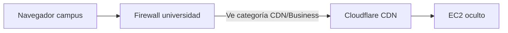

# Cloudflare — guía paso a paso (sin permisos de IT universitario)

Si la universidad bloquea `hotclick.lat` por categoría, **Cloudflare suele resolverlo** porque el firewall ve tráfico hacia la red de Cloudflare (CDN), no directamente hacia tu EC2 de e-commerce.

Tiempo estimado: **30–60 min** + propagación DNS (1–24 h).

## Checklist rápido

- [ ] 1. Crear cuenta Cloudflare y agregar `hotclick.lat`
- [ ] 2. Cambiar nameservers en Spaceship
- [ ] 3. Configurar DNS (A proxied + www)
- [ ] 4. SSL Full (strict) + Origin Certificate en EC2
- [ ] 5. Always Use HTTPS + HSTS en Cloudflare
- [ ] 6. Aplicar Nginx en EC2 y redeploy Docker
- [ ] 7. Verificar con `verify-cloudflare.sh`

---

## Paso 1 — Cuenta Cloudflare

1. Ir a [dash.cloudflare.com/sign-up](https://dash.cloudflare.com/sign-up)
2. **Add a site** → escribir `hotclick.lat`
3. Elegir plan **Free**
4. Cloudflare escaneará registros DNS existentes — revisar que aparezca:
   - `A` `@` → `18.227.68.15`
   - `A` `www` → `18.227.68.15`

---

## Paso 2 — Nameservers en Spaceship

Cloudflare mostrará 2 nameservers, por ejemplo:

```
ada.ns.cloudflare.com
bob.ns.cloudflare.com
```

En **Spaceship** (donde compraste el dominio):

1. Dominio `hotclick.lat` → **DNS / Nameservers**
2. Cambiar a **Custom nameservers**
3. Pegar los 2 NS de Cloudflare
4. Guardar

Esperar propagación. Podés verificar:

```bash
dig NS hotclick.lat +short
# Debe mostrar *.ns.cloudflare.com
```

---

## Paso 3 — DNS en Cloudflare

En Cloudflare → **DNS** → **Records**:

| Tipo | Nombre | Contenido | Proxy |
|------|--------|-----------|-------|
| A | `@` | `18.227.68.15` | **Proxied** (nube naranja) |
| A | `www` | `18.227.68.15` | **Proxied** |

### Clerk (auth social)

Si usás `clerk.hotclick.lat` como dominio custom de Clerk:

- Crear el registro que indique el dashboard de Clerk (CNAME o A)
- Dejarlo en **DNS only** (nube gris) si Clerk lo requiere
- No tocar otros registros de Clerk sin leer su doc

---

## Paso 4 — SSL/TLS

### 4A. En Cloudflare Dashboard

**SSL/TLS → Overview** → seleccionar **Full (strict)**

> No usar "Flexible" — eso deja HTTP entre Cloudflare y tu EC2.

### 4B. Origin Certificate (recomendado)

En Cloudflare → **SSL/TLS → Origin Server → Create Certificate**:

- Hostnames: `hotclick.lat`, `*.hotclick.lat`
- Validity: 15 years
- Create → copiar certificado y clave privada

En el **EC2**:

```bash
ssh ec2-user@18.227.68.15
cd /home/ec2-user/app
git pull origin master   # o la rama con los cambios de deploy

sudo bash Hot_click_outlet/deploy/cloudflare/install-origin-cert.sh
# Pegar certificado → END
# Pegar clave privada → END

sudo bash Hot_click_outlet/deploy/ec2/apply-nginx.sh
```

Alternativa: mantener Let's Encrypt (ya instalado) — también funciona con Full (strict).

---

## Paso 5 — Reglas de edge en Cloudflare

**SSL/TLS → Edge Certificates:**

- [x] **Always Use HTTPS** → ON
- [x] **Automatic HTTPS Rewrites** → ON
- [x] **HSTS** → Enable
  - Max Age: `31536000`
  - Include subdomains: ON
  - Preload: ON (opcional)

**Security → Settings:**

- Security Level: Medium
- Bot Fight Mode: ON (plan Free)

---

## Paso 6 — EC2 (Nginx + Docker)

```bash
ssh ec2-user@18.227.68.15
cd /home/ec2-user/app
git pull origin master

# Nginx con soporte Cloudflare real IP
sudo bash Hot_click_outlet/deploy/ec2/apply-nginx.sh

# Docker — 8080 solo localhost
cd Hot_click_outlet
docker-compose -f docker-compose.prod.yml up -d
```

**AWS Security Group** — eliminar inbound puerto **8080** (ver `deploy/ec2/security-group-hardening.md`).

---

## Paso 7 — Verificar

Desde cualquier red (incluida la universidad, tras propagación DNS):

```bash
bash Hot_click_outlet/deploy/cloudflare/verify-cloudflare.sh
bash scripts/check-security-headers.sh
```

Debe aparecer header `cf-ray` en la respuesta:

```bash
curl -sI https://hotclick.lat/api/health | grep -i cf-ray
```

Abrir `https://hotclick.lat` en el navegador de la universidad.

---

## Por qué esto ayuda en la red universitaria



El filtro categoriza la conexión a **Cloudflare**, no a un e-commerce `.lat` desconocido. Muchas redes bloquean Shopping pero permiten CDN.

---

## Si sigue bloqueado

1. Confirmar nube **naranja** (proxied) — no gris
2. Confirmar NS propagados: `dig NS hotclick.lat`
3. Probar modo incógnito / limpiar DNS local
4. Enviar recategorización en FortiGuard (sin ticket IT): [category-submit](https://www.fortiguard.com/faq/wf/category-submit)
5. Como último recurso: dominio `.com` adicional apuntando a la misma app

---

## Rollback

1. Spaceship → restaurar nameservers originales
2. Esperar propagación DNS
3. El sitio vuelve a resolver directo al EC2

Ver también: [README.md](./README.md) (detalles técnicos)
