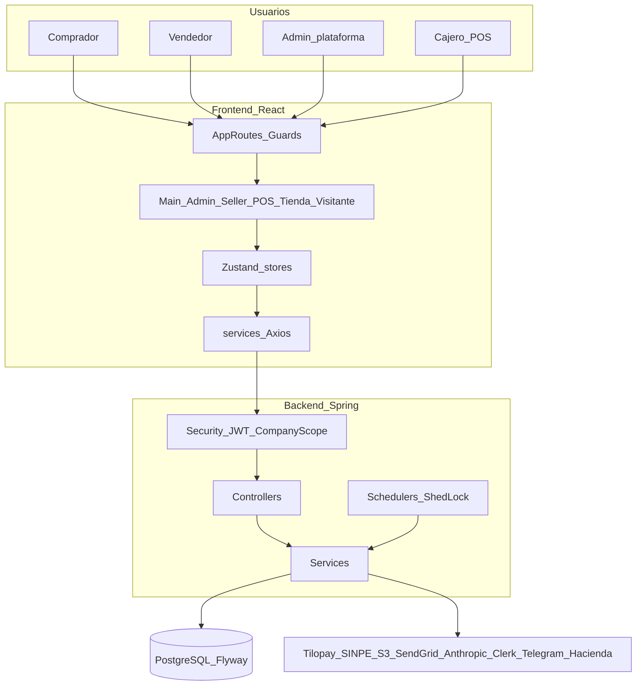
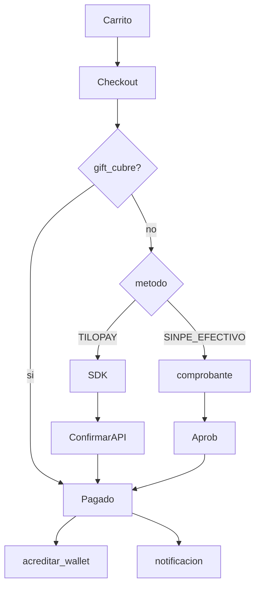
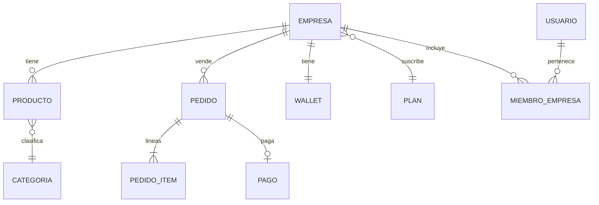

# Auditoría integral de la aplicación

**Fase 1 — solo diagnóstico.** Sin cambios de código, sin refactors, sin correcciones.  
**Fecha:** 2026-09-22 · **Método:** inspección estática del monorepo `Hot_click_outlet` (sin ejecutar app/tests en runtime).  
**Convención de evidencia:** `HECHO OBSERVADO` · `POSIBLE PROBLEMA` · `POSIBLE DUPLICACIÓN` · `POSIBLE MEJORA` · `❓ REQUIERE VALIDACIÓN` · cita `archivo:línea`.

**Fase 2 (validación P0 + plan de remediación):** [PHASE2_P0_VALIDATION.md](PHASE2_P0_VALIDATION.md)

**Anexos detallados:** [docs/audit/modulos/](modulos/)

| Anexo | Contenido |
|-------|-----------|
| [00-inventario-rutas.md](modulos/00-inventario-rutas.md) | ~120+ rutas FE, guards, aliases |
| [00-inventario-endpoints.md](modulos/00-inventario-endpoints.md) | 103 controllers / APIs |
| [00-modelo-datos.md](modulos/00-modelo-datos.md) | 88 entidades, 131 migraciones |
| [00-integraciones-jobs.md](modulos/00-integraciones-jobs.md) | Externos + schedulers + deploy |
| [auth-roles-tenant.md](modulos/auth-roles-tenant.md) | Auth, roles, CompanyScope |
| [checkout-pagos.md](modulos/checkout-pagos.md) | Tilopay / SINPE / wallet |
| [pedidos-fulfillment.md](modulos/pedidos-fulfillment.md) | Pedidos, encargos, recolecciones |
| [catalogo-productos.md](modulos/catalogo-productos.md) | Catálogo y visibilidad |
| [ui-shells-navegacion.md](modulos/ui-shells-navegacion.md) | Admin vs Figma seller |
| [pos-caja.md](modulos/pos-caja.md) | POS, QR, turnos |
| [inventario-captura.md](modulos/inventario-captura.md) | Paquetes PWA offline |
| [saas-billing-planes.md](modulos/saas-billing-planes.md) | Planes y billing |
| [admin-plataforma.md](modulos/admin-plataforma.md) | Consola IT |
| [ia-copilot-chat.md](modulos/ia-copilot-chat.md) | Claude, RAG, Telegram |
| [secundarios-comercial.md](modulos/secundarios-comercial.md) | CRM, cotizaciones, gifts, cupones |
| [secundarios-operacion.md](modulos/secundarios-operacion.md) | Compras, reportes, forecast |
| [contenido-publico.md](modulos/contenido-publico.md) | Blog, legales, emprende, SEO |

---

## 1. Resumen de arquitectura

**HECHO OBSERVADO:** monorepo Spring Boot 3.4 + React (Vite/pnpm) servido como SPA estática por el mismo jar/Docker.

| Capa | Tecnología | Ubicación |
|------|------------|-----------|
| Frontend | React + TypeScript, Zustand, Axios, React Router | `frontend/src/` |
| Backend | Java 21, Spring Security JWT, JPA | `src/main/java/com/hotclick/` |
| BD | PostgreSQL + Flyway (`ddl-auto=none`) | `db/migration/` V1–V133 |
| Media | AWS S3 (clase aún llamada `SupabaseStorageService`) | config S3 |
| Deploy | Docker Compose (`app` + `guardrails`), EC2/RDS o Lightsail/Render | `docker-compose*.yml` |

**Dominios presentes en código (más allá de CLAUDE.md):** marketplace multi-tenant, paneles Figma por plan, POS, inventario captura PWA, CRM, cotizaciones B2B, encargos, recolecciones, gift cards, cupones, compras/proveedores, facturación Hacienda CR, billing SaaS (Stripe/Onvo), wallet/payouts, AI copilot (Claude), chat público, Telegram, observabilidad.

**Pagos tienda (HECHO OBSERVADO):** Tilopay + SINPE + efectivo (pipeline SINPE) + gift card. ONVO flag off. Stripe sigue en código (billing/legado). Ver [checkout-pagos.md](modulos/checkout-pagos.md).

**Docs desfasadas (POSIBLE PROBLEMA):** `CLAUDE.md` documenta Stripe checkout y roles/staff que V132 vació; el código canónico es Tilopay + solo `ADMIN` de plataforma.

Flujo de capas típico:

```
Usuario → Routing/Guards → Pantalla → Store/Hooks → services/*.ts → /api/* → Controller → Service → Repository → PostgreSQL
                                                                                              ↘ Integraciones (Tilopay, S3, SendGrid, Anthropic, …)
```

---

## 2. Estructura del proyecto

```
Hot_click_outlet/
├── frontend/src/
│   ├── app/           # AppRoutes, guards, AdminRoleSwitch, PlanPathGate
│   ├── pages/         # Marketplace + admin legacy/Sistema
│   ├── prototipo/     # Shells Figma: visitante, emprendedor, pyme, negocio-plus
│   ├── components/, layouts/, store/, services/, hooks/, features/, db/
│   └── utils/         # sistemaUser, planPaths, modes
├── src/main/java/com/hotclick/
│   ├── controller/ (~103), service/, model/ (~88), repository/, security/, scheduler/, payment/, rag/
├── src/main/resources/db/migration/  # V1–V133 (huecos V100, V104)
├── docker-compose.prod.yml, Dockerfile, .env.example
├── security-tools/ (fuera del outlet: guardrails, deepteam — referenciados)
└── docs/audit/        # este documento
```

**Conteos aproximados (HECHO OBSERVADO):** ~841 `.java`, ~1400 `.ts/.tsx`, ~75 servicios FE, 9 stores Zustand, 131 migraciones.

---

## 3. Roles

Roles **JWT / Spring** activos (no inventados):

| Rol | Permisos / alcance | Rutas típicas | Restricciones |
|-----|-------------------|---------------|---------------|
| **ADMIN** | Todos + `global.*`; bypass `CompanyScope` | `/admin/**` IT | Sin tenant; no debe operar POS/tienda propia (`AdminRoleSwitch`) |
| **EMPRENDEDOR** | Permisos tenant (no `global.*`); plan → features | `/emprendedor`\|`/pyme`\|`/negocio-plus` (+ escapes `/admin/pos`, billing, config, copilot) | Aislado por `empresaId` |
| **USUARIO_FINAL** | Comprador | `/`, checkout, `/mis-pedidos`, `/perfil` | Sin panel negocio |
| **PROPIETARIO / EDITOR / LECTOR** | Membresía `MiembroEmpresa` | FE los trata como vendedor | **HECHO OBSERVADO:** JWT colapsa a `EMPRENDEDOR` (`RolMembresia`) — least-privilege de equipo anulado en Spring |
| **CAJERO / GERENTE / SUPERVISOR** | `ROLES_POS` en FE | `/admin/pos` | **POSIBLE PROBLEMA / LEGACY:** inactivos en BD (V89/V132); POS opera con EMPRENDEDOR/ADMIN |
| **SUPPORT / FINANCE / TRUST** | Constantes + `PlatformStaff` vacío | — | **CÓDIGO MUERTO tras V132** |

**Planes (no son roles):** `EMPRENDEDOR` · `PYME` · `NEGOCIO_PLUS` — gobiernan URL shell y `PlanGate` features.

### Matriz funcionalidad × rol

| Funcionalidad | USUARIO_FINAL | EMPRENDEDOR | PYME* | NEGOCIO_PLUS* | ADMIN | POS† |
| ------------- | ------------- | ----------- | ----- | ------------- | ----- | ---- |
| Catálogo / compra marketplace | ✅ | ✅ | ✅ | ✅ | ✅ | — |
| Checkout Tilopay/SINPE | ✅ (+guest) | ✅ | ✅ | ✅ | ✅ | — |
| Panel productos/pedidos seller | — | ✅ | ✅ | ✅ | workspace empresa | — |
| POS / caja | — | ✅‡ | ✅‡ | ✅‡ | ❓ | ✅ FE |
| Gift cards / forecast / compras | — | ❌ plan | ✅ | ✅ | IT | — |
| Sucursales | — | — | — | ✅ | — | — |
| Equipo (miembros) | — | ⚠️ | ✅ UI | ✅ | workspace | — |
| Aprobar empresas/pagos/payouts | — | — | — | — | ✅ | — |
| Impersonar tenant | — | — | — | — | ✅ | — |
| Inventario captura paquetes | — | — | — | — | ✅ SuperAdmin | — |
| Copilot AI | — | ✅ (créditos) | ✅ | ✅ | ✅ | — |

\* Plan del tenant, mismo rol JWT `EMPRENDEDOR`.  
† Roles POS legacy. ‡ Bypass `@PreAuthorize` permite EMPRENDEDOR.  
Detalle: [auth-roles-tenant.md](modulos/auth-roles-tenant.md).

---

## 4. Rutas

Inventario completo: [00-inventario-rutas.md](modulos/00-inventario-rutas.md).

**Zonas:**

| Prefijo | Propósito | Shell |
|---------|-----------|-------|
| `/`, `/productos`, `/carrito`, `/checkout`, … | Marketplace producción | `MainLayout` (por página) |
| `/visitante/*` | Prototipo Figma comprador (`noindex`) | `VisitanteShell` |
| `/emprendedor/*`, `/pyme/*`, `/negocio-plus/*` | Panel vendedor Figma | `EmprendedorShell` / `SellerShell` |
| `/admin/*` | Plataforma + escapes vendedor + redirects | `AdminLayout` / `POSShell` |
| `/tienda/:slug/*` | Tienda pública por tenant | `TiendaLayout` |
| `/prototipo/*` | Redirect legacy → prefijos | — |
| `/pos/pago/:token` | Pago QR cliente | sin admin shell |

**Hallazgos:**

- **HECHO OBSERVADO:** ~30 redirects/aliases en `/admin` (`tiendas`→`empresas`, `moderacion`→`aprobaciones`, …).
- **POSIBLE DUPLICACIÓN:** marketplace `/carrito` vs `/visitante/carrito` vs `/tienda/:slug/carrito`.
- **Posible código obsoleto:** `sellerAdminRoutes.tsx` sin imports; `AdminRoute` exportado y no montado.
- **❓ REQUIERE VALIDACIÓN:** checkout sin `ProtectedRoute` en router (guest permitido a propósito?).

---

## 5. Pantallas

Pantallas críticas (resumen; detalle en anexos de módulo):

### Marketplace — `HomePage` / `ProductsPage` / `ProductDetailPage` / `CartPage` / `CheckoutPage`
- **Entrada:** nav, SEO, deep links.
- **Estado inicial:** catálogo API pública; carrito en `cartStore` (localStorage).
- **Acciones:** buscar, filtrar, wishlist, checkout guest o auth.
- **Errores:** toasts / `mensajeErrorApi`; ❓ offline parcial.
- **Salidas:** `/pago/*`, `/mis-pedidos`.

### Paneles vendedor Figma — `MenuPage`, `ProductosPage`, `PedidosPage`, …
- **Entrada:** login → `PlanPathGate` por plan.
- **Dependencias:** mismos services que admin (`productService`, `orderService`).
- **POSIBLE DUPLICACIÓN:** vs páginas `Sistema*` / `Admin*` bajo `/admin`.

### Admin plataforma — `AdminDashboard`, `AdminEmpresas`, `AdminPagos`, …
- **Entrada:** rol `ADMIN` + guards IT/permiso/superadmin.
- **Procesos exclusivos:** aprobaciones, payouts, impersonación, security, capturas inventario.

### POS — `AdminPOS`, `AdminPOSCaja`, `POSPagoPage`
- Ver [pos-caja.md](modulos/pos-caja.md).

---

## 6. Módulos

| Módulo | FE clave | BE clave | Anexo |
|--------|----------|----------|-------|
| Auth / tenant | `authStore`, Login, Clerk | `AuthController`, `CompanyScope` | auth-roles-tenant |
| Catálogo | Products*, AdminNuevoProducto, prototipo Producto* | `ProductoController` | catalogo-productos |
| Checkout / pagos | `CheckoutPage`, Tilopay* | `PaymentController`, Tilopay/Sinpe | checkout-pagos |
| Pedidos / fulfillment | MisPedidos, AdminOrders, Encargos | `PedidoController`, Encargo*, Recoleccion* | pedidos-fulfillment |
| UI shells | AppRoutes, prototipo/*, AdminLayout | — | ui-shells-navegacion |
| POS | AdminPOS*, POSShell | Pos*, TurnoCaja* | pos-caja |
| Inventario captura | AdminInventario*, capturaOffline | InventarioPaquete* | inventario-captura |
| SaaS billing | AdminPlanes, Suscripcion | Suscripcion*, AdminBilling* | saas-billing-planes |
| Admin IT | AdminEmpresas, Aprobaciones, … | Empresa*, SolicitudAprobacion* | admin-plataforma |
| IA | Copilot, chat público | AiCopilot*, PublicChat*, RAG | ia-copilot-chat |
| Comercial / ops / público | ver anexos secundarios | CRM, Cotizacion, GiftCard, … | secundarios-* |

---

## 7. Procesos

Procesos reales detectados (no asumidos):

1. **Registro comprador** → OTP → `USUARIO_FINAL`
2. **Registro / alta empresa** → plan Emprendedor (cupo gratis) / upgrade
3. **Login** → Turnstile → password → (WebAuthn ADMIN) → (2FA) → (selección empresa) → JWT
4. **Clerk SSO** → sync → JWT (bloquea merge a ADMIN/EMPRENDEDOR sin clerkId)
5. **Navegación catálogo** → búsqueda FTS/trigram → detalle → carrito
6. **Checkout** → envío → método pago → stock reserve → pago → confirmación → wallet
7. **SINPE** → comprobante → aprobación admin/auto → PAGADO
8. **Gestión pedido** → estados / guía / email / WhatsApp link
9. **Encargo personalizado** → cotización artista → checkout token → fulfillment
10. **Recolección GAM** → tarifa ADMIN → ciclo logístico
11. **Alta producto** (seller Figma o Sistema/Admin) → aprobación si aplica → catálogo
12. **POS venta** → turno → cobro efectivo/QR → ENTREGADO
13. **Captura inventario** → paquete offline → sync → asignar a empresa
14. **Billing SaaS** → trial/checkout Onvo/Stripe → renewals
15. **Payout wallet** → solicitud → auto/manual approve
16. **Impersonación** ADMIN → JWT EMPRENDEDOR 30 min
17. **Copilot / chat / Telegram IA** → moderación parcial → Claude (+ tools)

Diagramas de pasos: anexos de cada módulo.

---

## 8. Flujos de usuario

### Comprador marketplace (camino feliz)

```
/ → /productos → /productos/:id → /carrito → /checkout
  → Tilopay SDK | SINPE comprobante | gift card
  → /pago/tilopay/respuesta | /pago/exito
  → email confirmación → /mis-pedidos → seguimiento
```

### Vendedor (plan Emprendedor)

```
/login → (mode-select / seleccionar-negocio) → /emprendedor
  → productos/nuevo → pedidos → reportes
  → opciones (cobro, telegram, plan)
  → escape /admin/pos | /admin/billing | /admin/copilot
```

### Admin plataforma

```
/login (+ WebAuthn?) → /admin
  → empresas / aprobaciones / pagos / payouts
  → impersonar → panel tenant → finalizar impersonación
```

### POS QR

```
Cajero /admin/pos → POST sesión QR → cliente /pos/pago/:token
  → ONVO/SINPE → pedido ENTREGADO → poll cajero → recibo
```

---

## 9. Dependencias

### Fuertes
- Checkout → StockReservation → Pago → PaymentOrderConfirmation → Wallet
- Seller shell → `tenantStore.planNombre` → `PlanPathGate`
- Catálogo público → flags empresa/producto (`visible_catalogo`, estado empresa)
- Impersonación → JWT claims + banner FE + bloqueo refresh

### Circulares / acoplamiento
- **POSIBLE PROBLEMA:** `AdminRoleSwitch` remapea vendedor a Figma **y** muchas rutas `/admin` aún existen con `RedirectSiSistema` (doble capa).
- Auth refresh puede **perder** `empresaId` seleccionado (`AuthRefreshHandler`) — ver auth anexo.

### Duplicación estructural
- Dos UIs vendedor: `/admin` Sistema* vs `/emprendedor|pyme|negocio-plus`
- Tres carritos/checkout (marketplace, visitante, tienda slug)
- Providers pago: Tilopay activo + Onvo/Stripe en código

---

## 10. Modelo de datos

Detalle: [00-modelo-datos.md](modulos/00-modelo-datos.md).

```
Usuario ──M2M── Rol ──M2M── Permiso
   │
   ├─ MiembroEmpresa ──► Empresa ──► Plan / Suscripcion / Wallet
   │                         ├─ Producto / Bodega / Sucursal / Marca
   │                         ├─ Pedido ── PedidoItem / Pago / Comprobante*
   │                         └─ TurnoCaja / Cotizacion / Encargo / MetodoCobro
   └─ (comprador) Pedido, Carrito, RefreshToken, WebAuthn
```

**Mapa FE → API → entidad → tabla (ejemplos):**

| FE | API | Entidad | Tabla |
|----|-----|---------|-------|
| `cartStore` | `/api/payments/checkout` | `Pedido`+`Pago` | `hot_click_pedido_tb` / `pago_tb` |
| `productService` | `/api/productos` | `Producto` | `hot_click_producto_tb` |
| `authStore` | `/api/auth/login` | `Usuario`+`Rol` | `usuario_tb` / `rol_tb` |
| `tenantStore` | `/api/billing/suscripcion` | `Suscripcion`/`Plan` | `suscripcion_tb` / `plan_tb` |
| `posStore` | `/api/pos/venta` | `Pedido`+`TurnoCaja` | `pedido_tb` / `turno_caja_tb` |

---

## 11. Integraciones

Detalle: [00-integraciones-jobs.md](modulos/00-integraciones-jobs.md).

| Críticas | Medio | Opcionales / off |
|----------|-------|------------------|
| PostgreSQL, JWT, Tilopay, SINPE, S3, SendGrid, Anthropic | Clerk, Telegram, Hacienda, Sentry, PostHog, WebAuthn, Voyage | NVIDIA (sin uso Java), ONVO checkout (flag), Stripe checkout UI, Twilio, AbuseIPDB, Turnstile (pasa si vacío), guardrails sidecar |

**Jobs ShedLock (muestra):** payment expiration 5m · SINPE auto 1AM · payout auto 15m · data retention 2:30 · billing renewal 3AM · forecast/ABC/embeddings ~4AM · wallet DLQ 5m · carrito abandonado 6h.

---

## 12. Funcionalidades duplicadas

| Elemento A | Elemento B | Similitud | Uso aparente | Riesgo de mantener ambos |
|------------|------------|-----------|--------------|--------------------------|
| `/admin` Sistema* páginas | `/emprendedor|pyme|negocio-plus` Figma | Mismos servicios, UX distinta | Figma = destino remap vendedor | Drift de features; bugs solo en un shell |
| Marketplace `/` compra | `/visitante/*` | Flujo compra paralelo | Visitante `noindex` | Confusión SEO/QA |
| Checkout marketplace | `TiendaCheckoutPage` | Pedido/pago | Ambos vivos | Reglas de precio/comisión divergentes |
| Tilopay | Onvo + Stripe providers | Misma `PaymentProvider` | Tilopay UI; otros código/billing | Default provider `"STRIPE"` si null |
| `AdminOrders` | `SistemaVentasPedidos` / prototipo `PedidosPage` | Gestión pedidos | Switch por rol | Estados UI distintos |
| CRM `AdminClientes` | tab CRM en `AdminUsers` | Clientes | Ambos | POSIBLE DUPLICACIÓN UI |
| Constantes SUPPORT/FINANCE/TRUST | V132 roles vacíos | Staff | Solo ADMIN | Código muerto confuso |
| `CLAUDE.md` Stripe | Código Tilopay | Docs vs realidad | Docs | Onboarding erróneo |

---

## 13. Procesos potencialmente innecesarios

| Cadena | Clasificación | Evidencia |
|--------|---------------|-----------|
| Vendedor entra `/admin/X` → remap → Figma → a veces vuelve a `/admin` para POS/billing | **posiblemente necesario** (escapes explícitos) | `vendedorSeQuedaEnAdmin` |
| Login → ModeSelector → seleccionar-negocio → panel | **requiere validación** (¿siempre?) | flujos multi-empresa |
| SINPE: upload → espera admin → auto 1AM | **posiblemente necesario** (compliance CR) | SinpeService |
| `/prototipo/*` redirects | **posiblemente redundante** (legacy bookmarks) | PrototipoRedirect |
| Guardrails container en compose sin tráfico Claude | **posiblemente redundante** | compose + 0 usos nvidia Java |
| Confirmaciones múltiples eliminar producto Figma | **posiblemente necesario** (a11y/UX) | ConfirmarEliminar* |
| Alias `/admin/tiendas` → empresas | **claramente duplicado** (alias) | AppRoutes redirects |

---

## 14. Código potencialmente obsoleto

| Ítem | Por qué sospechoso |
|------|-------------------|
| `ROLES_STAFF` / `PlatformStaff.ROLES` vacíos | V132; maquinaria `global.*` queda solo para ADMIN |
| Roles POS en BD inactivos + FE `ROLES_POS` | POS bypass EMPRENDEDOR |
| `sellerAdminRoutes.tsx` | Sin imports |
| `AdminRoute` | No montado en Routes |
| `StripeEvento` / Stripe checkout UI | Billing/legado; no en PaymentMethods |
| NVIDIA env + sidecar | Copilot usa Anthropic |
| `PublicacionFacebookService` | No llama Graph API |
| Constants `PEDIDO_CONFIRMADO`/`PREPARANDO` | Casi no usados en UI |
| `render.yaml` `MAIL_PASSWORD` | No en application.properties |
| Docs Stripe como checkout principal | CLAUDE.md vs PaymentMethods |

Marcado solo como **posible**; no eliminar en esta fase.

---

## 15. Posibles errores

### Frontend
- Remap admin↔seller puede dejar bookmarks rotos — **POSIBLE PROBLEMA**
- Impersonación + refresh bloqueado — **HECHO OBSERVADO** (diseño)
- POS FE unwrap ResponseDTO — **POSIBLE PROBLEMA** (pos-caja)
- Multi-pestaña carrito localStorage — **❓ REQUIERE VALIDACIÓN**
- Visitante vs marketplace: estados carrito no compartidos — **HECHO OBSERVADO**

### Backend
- `cambiarEstado` pedido sin máquina de estados — **POSIBLE PROBLEMA** (saltos libres)
- Webhook Tilopay sin secret fuerte — **POSIBLE PROBLEMA** (checkout anexo)
- TTL cancelación pagos vs SINPE; pedidos SINPE sin `empresa` (wallet) — **POSIBLE PROBLEMA**
- `guest/cancel` + confirmar/reintentar Tilopay públicos — **POSIBLE PROBLEMA** (checkout)
- WebAuthn `authenticatedEmail` attribute ausente — **POSIBLE PROBLEMA**
- Refresh token pierde empresa seleccionada; switch empresa sin claim `permisos` — **POSIBLE PROBLEMA**
- Cierre turno caja IDOR; precios/descuento POS desde cliente — **POSIBLE PROBLEMA** (pos-caja)
- `/api/ruleta/.../{usuarioId}` sin ownership — **POSIBLE PROBLEMA** (IDOR; endpoints)
- Encargos admin `kpis`/`eventos`/`fulfillment` solo AUTH (no A\|E) — **POSIBLE PROBLEMA**
- Reglas `mis-negocios`/`cambiar-negocio`/`nuevo-negocio` muertas tras `permitAll /api/auth/**` — **HECHO OBSERVADO**
- `PlanGate` fail-open si tenant no carga — **POSIBLE PROBLEMA**
- Feed/sitemap/detalle producto sin mismo gate marketplace — **POSIBLE PROBLEMA** (catálogo)
- Import/bulk producto bypass `ProductoApprovalService` — **POSIBLE PROBLEMA**
- SSE stock + ShedLock multi-pod — **POSIBLE PROBLEMA**
- Impersonación: JWT no revocable; webhooks admin visibles a EMPRENDEDOR — **POSIBLE PROBLEMA** (admin-plataforma)

### Base de datos
- Dos sistemas de rol (JWT vs `rol_en_empresa`) — **HECHO OBSERVADO**
- Soft-delete inconsistente entre entidades — **HECHO OBSERVADO**
- Retención webhook usa `created_at` pero columna es `fecha_recepcion` — **POSIBLE PROBLEMA**
- Dualidad `plan_saas` vs `fk_id_plan`; degradación billing a plan `FREE` inactivo — **POSIBLE PROBLEMA**
- Huecos migración V100/V104 — **❓ REQUIERE VALIDACIÓN** impacto

### Integraciones
- Tilopay mock si faltan creds — **HECHO OBSERVADO** (peligroso en prod mal configurado)
- Turnstile vacío = always pass — **HECHO OBSERVADO**
- SendGrid sin fallback SMTP — **HECHO OBSERVADO**
- Chat público / shopping assistant sin cuota de llamadas (costo Anthropic) — **POSIBLE PROBLEMA** (ia-copilot)

---

## 16. Escenarios de prueba

Leyenda por módulo crítico (detalle en anexos):

### Checkout / pagos
| Escenario | Estado |
|-----------|--------|
| Camino feliz Tilopay | ✅ contemplado (confirmar + webhook path) |
| Datos inválidos | ⚠️ validación BE/FE parcial |
| Cancelación usuario | ✅ cancel endpoints |
| Doble clic / repetición | ⚠️ idempotencia webhook/merchant token — revisar |
| Refresh mid-pago | ⚠️ Tilopay respuesta + status poll |
| Sesión expirada | ⚠️ guest vs auth paths |
| Timeout / expiración | ✅ job 30 min (+ riesgos SINPE) |
| Offline | ❌ |
| Concurrencia stock | ✅ reservas + optimistic producto |
| Webhook duplicado | ⚠️ WebhookEvent — validar unicidad |

### Pedidos
| Escenario | Estado |
|-----------|--------|
| Happy path estados | ⚠️ UI guía; BE sin FSM |
| Salto de estado admin | ✅ posible (sin validar) = riesgo |
| Recurso inexistente | ⚠️ 404 controllers |
| Encargo vencido | ✅ job / fecha |
| Notificación email falla | ⚠️ no debe tumbar pedido — validar |

### Auth / tenant
| Escenario | Estado |
|-----------|--------|
| Login + 2FA + multi-empresa | ✅ |
| Sin permisos ruta IT | ✅ guards |
| Impersonación | ✅ |
| Token muerto mid-flujo | ⚠️ interceptor 401 refresh |
| Clerk merge ADMIN | ✅ bloqueado 403 |

### POS / inventario
| Escenario | Estado |
|-----------|--------|
| Venta sin turno | ⚠️ permite venta + warn |
| Offline captura | ✅ IndexedDB + cola |
| Sync conflicto | ❓ |

---

## 17. Matriz de cobertura

| Funcionalidad | Camino feliz | Error | Cancelación | Repetición | Sesión expirada | Permisos | Offline | Refresh | Concurrencia |
| ------------- | ------------ | ----- | ----------- | ---------- | --------------- | -------- | ------- | ------- | ------------ |
| Login / 2FA | ✅ | ✅ | ⚠️ | ⚠️ | ✅ | ✅ | ❌ | ⚠️ | ❓ |
| Catálogo público | ✅ | ⚠️ | — | ✅ | — | — | ❌ | ✅ | ❓ |
| Checkout Tilopay | ✅ | ⚠️ | ✅ | ⚠️ | ⚠️ | ⚠️ | ❌ | ⚠️ | ⚠️ |
| Checkout SINPE | ✅ | ⚠️ | ⚠️ | ⚠️ | ⚠️ | ✅ admin | ❌ | ⚠️ | ❓ |
| Pedidos admin/seller | ✅ | ⚠️ | ⚠️ | ❓ | ⚠️ | ✅ | ❌ | ✅ | ❌ FSM |
| POS venta/QR | ✅ | ⚠️ | ✅ QR | ⚠️ | ⚠️ | ⚠️ legacy | ❌ | ⚠️ | ⚠️ |
| Captura inventario | ✅ | ⚠️ | ⚠️ | ⚠️ | ⚠️ | ✅ ADMIN | ✅ | ⚠️ | ❓ |
| Billing planes | ✅ | ⚠️ | ⚠️ | ❓ | ⚠️ | ✅ | ❌ | ⚠️ | ❓ |
| Copilot AI | ✅ | ⚠️ | — | ⚠️ rate | ⚠️ | ✅ | ❌ | ⚠️ | ❓ |
| Impersonación | ✅ | ⚠️ | ✅ fin | ❓ | ✅ TTL | ✅ | — | ❌ refresh | — |

---

## 18. Estados y transiciones

### Pedido (`estado_pedido`)
Ver diagrama completo en [pedidos-fulfillment.md](modulos/pedidos-fulfillment.md).

```
PENDIENTE ──pago──► PAGADO ──► EN_PREPARACION ──► ENVIADO|LISTO_RETIRO ──► ENTREGADO (──► COMPLETADO)
    │                 ▲
    └── CANCELADO     └── SINPE: PENDIENTE_COMPROBANTE → PENDIENTE_APROBACION
```

**POSIBLE PROBLEMA:** sin validación de transiciones en `PedidoService.cambiarEstado`.

### Pago
`PENDIENTE → CAPTURADO | FALLIDO | CANCELADO | REEMBOLSADO` (`Constants`).

### Encargo / Recolección / PosQrSesion / TurnoCaja / GiftCard / Cotización
Documentados en anexos respectivos.

---

## 19. Riesgos

| Severidad | Riesgo | Evidencia |
|-----------|--------|-----------|
| **CRÍTICA** | Pagos + stock + wallet (TTL SINPE, empresa null, guest cancel) | [checkout-pagos](modulos/checkout-pagos.md) |
| **CRÍTICA** | Tenant isolation depende de `CompanyScope` en cada endpoint | [auth-roles-tenant](modulos/auth-roles-tenant.md) |
| **ALTA** | Dual UI vendedor (drift) + Sistema* huérfanas | [ui-shells-navegacion](modulos/ui-shells-navegacion.md) |
| **ALTA** | Estados pedido sin FSM | [pedidos-fulfillment](modulos/pedidos-fulfillment.md) |
| **ALTA** | POS: IDOR turno, precios cliente, roles legacy | [pos-caja](modulos/pos-caja.md) |
| **ALTA** | Visibilidad catálogo inconsistente (feed/detalle/import) | [catalogo-productos](modulos/catalogo-productos.md) |
| **ALTA** | Docs Stripe vs Tilopay; Tilopay mock; ~469 endpoints | [00-integraciones-jobs](modulos/00-integraciones-jobs.md), [00-inventario-endpoints](modulos/00-inventario-endpoints.md) |
| **MEDIA** | Billing FREE inactivo / trial PRO / PlanGate fail-open | [saas-billing-planes](modulos/saas-billing-planes.md) |
| **MEDIA** | Impersonación no revocable + webhooks cross-tenant | [admin-plataforma](modulos/admin-plataforma.md) |
| **MEDIA** | IA pública sin cuota; sidecar NVIDIA muerto | [ia-copilot-chat](modulos/ia-copilot-chat.md) |
| **MEDIA** | Staff roles muertos; EDITOR=EMPRENDEDOR JWT | V132 / RolMembresia |
| **MEDIA** | Retención webhook columna incorrecta | [00-modelo-datos](modulos/00-modelo-datos.md) |
| **BAJA** | Compras/forecast/executive inaccesibles por guards cruzados | [secundarios-operacion](modulos/secundarios-operacion.md) |

---

## 20. Áreas que requieren investigación adicional

1. **Runtime:** ¿webhook Tilopay autentica en prod? ¿secret configurado?
2. **¿Guest checkout** es intencional sin `ProtectedRoute`?
3. **¿Compras/proveedores** accesibles para alguien tras RedirectSiSistema + admin IT block?
4. **Cotizaciones** sin ruta seller equivalente tras remap.
5. **Concurrencia** multi-pestaña carrito y captura offline.
6. **Cobertura tests** real vs matrices (esta fase no ejecutó Vitest/Maven).
7. **Stripe** billing vs Onvo billing: cuál está activo en prod EC2 `.env`.
8. **WebAuthn** registro ADMIN en runtime (attribute missing).
9. **Visibilidad marketplace** legal (todos los tenants aprobados) — tests de query.
10. **PayPal / PayXpert** docs y webhook stub — ¿vivos?

---

## 21. Diagramas Mermaid

### 21.1 Arquitectura general



### 21.2 Roles y shells

```mermaid
flowchart LR
  JWT[JWT_rol] --> ADMIN
  JWT --> EMPRENDEDOR
  JWT --> USUARIO_FINAL
  ADMIN --> AdminLayout
  EMPRENDEDOR --> PlanGate{plan}
  PlanGate -->|EMPRENDEDOR| EmpShell[/emprendedor]
  PlanGate -->|PYME| PymeShell[/pyme]
  PlanGate -->|NEGOCIO_PLUS| PlusShell[/negocio-plus]
  EMPRENDEDOR --> Escapes[/admin/pos_billing_config_copilot]
  USUARIO_FINAL --> MainLayout
```

### 21.3 Checkout (resumen)



### 21.4 Datos tenant



---

## 22. Conclusiones del diagnóstico

1. **La app real es un SaaS marketplace multi-tenant** con POS, inventario digitalizado, billing, wallet, IA y fulfillment CR — no solo el e-commerce descrito en `CLAUDE.md`.

2. **Hay dos “productos” de UI vendedor coexistiendo** (`/admin` Sistema + shells Figma por plan). El remap en `AdminRoleSwitch` intenta unificar la entrada, pero genera complejidad **CRÍTICA** de navegación y riesgo de drift.

3. **Pagos productivos de tienda = Tilopay + SINPE (+ gift/efectivo).** Stripe/Onvo siguen en el backend; la documentación que pone Stripe como checkout principal está **desfasada**.

4. **Modelo de roles simplificado en BD (V132) no se refleja del todo en FE/Constants:** staff vacío, POS legacy, membresía EDITOR colapsada a EMPRENDEDOR.

5. **Pedidos sin FSM** y **POS con bypass de roles** son focos de riesgo operativo altos.

6. **Esta fase no midió runtime ni cobertura de tests ejecutados.** Las matrices marcan `❓` donde hace falta validación dinámica.

7. **Siguiente fase recomendada (fuera de alcance):** auditorías especializadas por anexo (seguridad pagos, tenant isolation, QA shells, limpieza código muerto) — **sin implementar aún**, solo priorizar.

---

*Fin del documento maestro Fase 1. Todo lo anterior es diagnóstico basado en evidencia del repositorio.*
