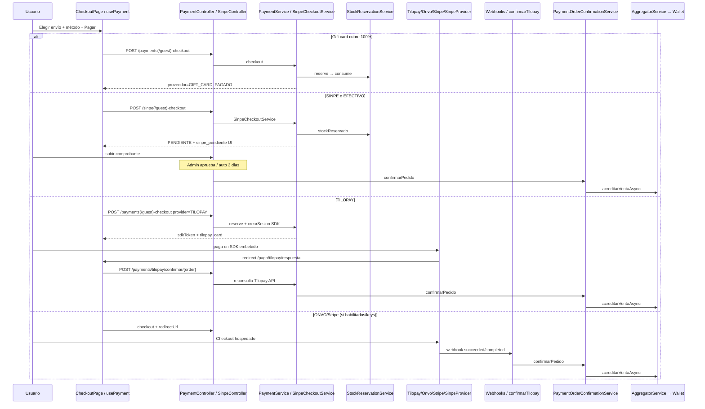

# Auditoría estática READ-ONLY — Checkout / Pagos

Ámbito: `C:\Cursor-test-hot\Hot-click-dev\Hot_click_outlet` (sin modificaciones).  
Etiquetas: `[código]` evidencia en repo · `[docs-desfasado]` documentación vs código · `[riesgo]` impacto operativo/seguridad.

---

## 1. Métodos de pago reales

| Método | ¿En UI checkout? | Backend | Estado | Notas |
|--------|------------------|---------|--------|-------|
| **Tilopay** (Visa/MC embebido) | Sí — `TILOPAY` | `TilopayPaymentProvider` + `TilopayConfirmacionService` | **Activo (principal tarjeta)** | SDK embebido; confirmación por API reconsulta |
| **SINPE Móvil** | Sí | `/api/sinpe/*` → `SinpeCheckoutService` | **Activo** | Manual: comprobante + admin/auto-aprobación |
| **Gift card** | Sí (campo en layout) | rama en `PaymentService.checkout` | **Activo** | Si saldo cubre total → `PAGADO` inmediato, sin `Pago` de pasarela |
| **Efectivo contra entrega** | Sí — `EFECTIVO` | Misma ruta SINPE (`isManual`) | **Activo vía pipeline SINPE** | No hay `EfectivoPaymentProvider`; UI lo trata como manual |
| **ONVO** | No en `PaymentMethods` | `OnvoPaymentProvider` + webhook | **Código vivo, flag off** | `payments.onvo.enabled=false` por defecto |
| **Stripe (ecommerce)** | No | `StripePaymentProvider` + `BillingWebhookController` | **Legado / billing** | Default interno sigue siendo `"STRIPE"` si no hay provider |
| **Efectivo POS / caja** | Fuera de este checkout | `PosVentaService`, `VentaService`, `SelfCheckoutService` | **Activo en POS** | Distinto del checkout web |

**Evidencia UI (métodos ofrecidos):**

```12:42:C:\Cursor-test-hot\Hot-click-dev\Hot_click_outlet\frontend\src\pages\checkout\PaymentMethods.tsx
  return [
    { id: 'TILOPAY', ... },
    { id: 'SINPE', ... },
    { id: 'EFECTIVO', ... disabled: metodoEnvio === 'ENVIO_RAPIDO', ... },
  ]
```

**EFECTIVO → pipeline SINPE:**

```159:192:C:\Cursor-test-hot\Hot-click-dev\Hot_click_outlet\frontend\src\pages\checkout\ejecutarPagarCheckout.ts
  const isManual = metodoPago === 'SINPE' || metodoPago === 'EFECTIVO'
  ...
  iniciarPago({ ..., provider: metodoPago, ... }, !token, isManual)
```

**ONVO deshabilitado por defecto:**

```35:39:C:\Cursor-test-hot\Hot-click-dev\Hot_click_outlet\src\main\java\com\hotclick\service\payment\CheckoutValidator.java
        String provider = req.getProvider() != null ? req.getProvider().toUpperCase() : "STRIPE";
        if (Constants.PROVEEDOR_ONVO.equals(provider) && !onvoEnabled) {
            throw new IllegalArgumentException(
                "ONVO no está habilitado. Usá TILOPAY para pagos con tarjeta.");
```

`application.properties`: `payments.onvo.enabled=${PAYMENTS_ONVO_ENABLED:false}` `[código]`

**Proveedores registrados:** `STRIPE`, `SINPE`, `ONVO`, `TILOPAY` vía `PaymentProviderFactory` (Spring inyecta todos los `@Component` `PaymentProvider`). `[código]`

---

## 2. Flujo checkout paso a paso



**Orquestación central (`PaymentService`):**

```55:117:C:\Cursor-test-hot\Hot-click-dev\Hot_click_outlet\src\main\java\com\hotclick\service\PaymentService.java
    public PaymentCheckoutResponse checkout(...) {
        checkoutValidator.validateCartNotEmpty(req);
        String provider = checkoutValidator.resolveProvider(...);
        ...
        StockReservationResult reservation = stockReservationService.reserveForCheckout(...);
        OrderPricingResult pricing = orderPricingService.calculate(...);
        Pedido pedido = checkoutOrderFactory.createPendingOrder(...);
        if (pricing.pagoGC()) { /* canje + PAGADO */ }
        session = providerFactory.get(provider).crearSesion(...);
        paymentRecordFactory.createAndPersist(...);
        /* respuesta embebida o redirect */
    }
```

**Stock:** reserve en checkout → consume en confirmación → libera en fallo/cancel/TTL. `[código]`

---

## 3. Webhooks e idempotencia

| Endpoint | Auth | Idempotencia | Confirma pago |
|----------|------|--------------|---------------|
| `POST /api/webhooks/tilopay` | **Ninguna** (público) | `existsByMerchantTokenAndEventoTipo(order, tilopay.webhook)` + unique `(merchant_token, evento_tipo)` | Reconsulta API → `aplicarAprobado` |
| `POST /api/webhooks/onvo` | `X-Webhook-Secret` timing-safe | Evento `checkout-session.succeeded` + unique DB; guard `CAPTURADO` | Sí (o POS QR) |
| `POST /api/webhooks/stripe` | Firma Stripe | `suscripcionService.marcarEventoRecibido(eventId)` + `StripePaymentProvider` | Sí ecommerce + billing |
| `POST /api/webhooks/payxpert` | — | — | **410 Gone** (archivado) |
| `WebhookController` uptime/sentry | Secret query | N/A | No es pagos |

**Tilopay webhook — sin secreto, siempre 200:**

```24:37:C:\Cursor-test-hot\Hot-click-dev\Hot_click_outlet\src\main\java\com\hotclick\controller\TilopayWebhookController.java
    @PostMapping("/tilopay")
    public ResponseEntity<Map<String, String>> recibir(...) {
        ...
        tilopayConfirmacionService.procesarWebhook(...);
        ...
        return ResponseEntity.ok(Map.of("status", "ok"));
    }
```

Comentario del propio controlador: *“contrato pendiente… no confía en el body sin verificación OrderHash”* — mitiga confiando en `consultarTransaccion`, no en el payload. `[código]` `[riesgo]`

**ONVO — secreto + idempotencia app-level:**

```77:82:C:\Cursor-test-hot\Hot-click-dev\Hot_click_outlet\src\main\java\com\hotclick\payment\OnvoPaymentProvider.java
        if (webhookEventRepository.existsByMerchantTokenAndEventoTipo(
                checkoutSessionId, "checkout-session.succeeded")) {
            log.info("[onvo] Webhook duplicado ignorado: sessionId={}", checkoutSessionId);
            return;
        }
```

Unique en entidad `WebhookEvent` (`uq_webhook_token_tipo`). `[código]`  
Race TOCTOU posible entre dos webhooks concurrentes antes del INSERT; el unique fuerza fallo del segundo (Onvo/Tilopay no siempre capturan esa excepción → posible 500 y reintento). `[riesgo]`

**Confirmación Tilopay (browser, no webhook):**

```59:62:C:\Cursor-test-hot\Hot-click-dev\Hot_click_outlet\src\main\java\com\hotclick\service\payment\TilopayConfirmacionService.java
        if (Constants.PAGO_CAPTURADO.equals(pago.getEstadoPago())) {
            log.info("[tilopay] Confirmación duplicada ignorada order={}", orderNumber);
            return paymentService.buildStatusResponse(pago);
        }
```

**Confirmación de pedido (segunda capa):**

```38:42:C:\Cursor-test-hot\Hot-click-dev\Hot_click_outlet\src\main\java\com\hotclick\service\payment\PaymentOrderConfirmationService.java
        if (Constants.PEDIDO_PAGADO.equals(pedido.getEstadoPedido())) {
            log.info("confirmarPedido ignorado — pedido {} ya está PAGADO", ...);
            return;
        }
```

**Wallet (tercera capa):** unique partial `uq_wallet_tx_credito_por_pedido` (V81) + catch `DataIntegrityViolationException` en `AggregatorService`. `[código]`

**Rutas públicas pago** (`SecurityAuthorizationRules`): `/api/webhooks/**`, guest checkout/cancel, `status`, `tilopay/confirmar`, `tilopay/reintentar`, sinpe guest. `[código]` `[riesgo]`

---

## 4. Estados de pago / sesión / pedido

### Pago (`Constants`)

| Estado | Uso |
|--------|-----|
| `PENDIENTE` | Sesión creada / SINPE esperando |
| `CAPTURADO` | Cobrado / confirmado |
| `FALLIDO` | Rechazo Tilopay, cancel usuario (`marcarFallido`) |
| `CANCELADO` | TTL cleanup |
| `REEMBOLSADO` | Constante; fuera de este flujo principal |

### Pedido (checkout)

| Estado | Cuándo |
|--------|--------|
| `PENDIENTE` | Checkout tarjeta/pasarela |
| `PENDIENTE_COMPROBANTE` | Checkout SINPE/EFECTIVO |
| `PENDIENTE_APROBACION` | Tras subir comprobante |
| `PAGADO` | Confirmación / gift card full |
| `CANCELADO` | Fallo con pedido aún `PENDIENTE`, o TTL |

### Frontend `usePayment.estado`

`idle` → `loading` → `tilopay_card` | `sinpe_pendiente` | `gift_card_paid` | `redirecting` → `polling` → `success` | `failed` | `cancelled` | `timeout` | `pending`  
Polling: 3 s × 60 ≈ 3 min (`POLL_INTERVAL_MS` / `POLL_MAX_ATTEMPTS`). `[código]`

### Sesión Tilopay

- `merchantToken` = `numeroPedido` (o `numeroPedido-R{n}` en reintento)
- `sdkToken` ~1 h (cache TilopayService)
- `fechaExpiracion` pago: 30 min (reintento también 30 min)
- TTL scheduler: cada 5 min, corte **30 min desde `fechaCreacion`** (no usa `fechaExpiracion`) `[riesgo]`

---

## 5. Escenarios

### Doble clic en “Pagar”
- **No hay idempotency-key** en checkout.
- Cada clic → nuevo pedido + nueva reserva de stock.
- Frontend: `intentos` + `MAX_INTENTOS=3` solo en `reintentar`, no bloquea doble submit en el primero. `[riesgo]`

### Refresh en checkout
- Estado React se pierde; carrito Zustand/localStorage puede seguir.
- Tras `sinpe_pendiente` / `gift_card_paid` el carrito ya se limpió (`CheckoutPage` effect) → refresh puede mostrar carrito vacío aunque el pedido exista. `[código]`
- Tilopay mid-pago: `ran` ref en `TilopayRespuestaPage` evita doble confirm en Strict Mode; F5 re-ejecuta confirmar (idempotente si ya `CAPTURADO`).

### Webhook duplicado
- Onvo/Stripe/Tilopay: guard por `(merchant_token, evento_tipo)` + estado `CAPTURADO` + pedido `PAGADO` + unique wallet. Diseño sólido en capas. `[código]`

### Timeout
- Redirect pasarela: 12 s → `failed` si no navega (`usePayment`).
- Polling éxito: 3 min → `timeout` → UI `PagoPendiente` (no cancela solo).
- Backend TTL: cancela pagos `PENDIENTE` con `fechaCreacion < now-30m`; **antes**, Tilopay intenta `intentarConfirmarSiAprobado` (evita cancelar pago ya aprobado en pasarela). `[código]`

### Cancelación
- Auth: `POST /payments/cancel/{numero}` — dueño + pedido `PENDIENTE` + pago no `CAPTURADO` → `marcarFallido` (estado `FALLIDO`).
- Guest: `POST /payments/guest/cancel/{numero}` — **sin auth**, solo conocer el número. `[riesgo]`
- Cancelación usuario **no aplica** a `PENDIENTE_COMPROBANTE` (SINPE): exige `PEDIDO_PENDIENTE`.
- `PaymentStatusPage` en ruta cancelación llama `cancelarPedido` automáticamente.

### Race: cancel vs webhook
- `marcarFallido` no revierte si ya `CAPTURADO`.
- Si cancel gana primero → `FALLIDO` + libera stock; webhook posterior podría marcar `CAPTURADO` y confirmar (reversión de stock/negocio). Depende del orden TX. `[riesgo]` medio-alto.

---

## 6. Duplicaciones / docs desactualizadas

| Hallazgo | Evidencia |
|----------|-----------|
| **CLAUDE.md documenta Stripe como checkout** | `POST /api/payment/checkout` (ruta incorrecta: real es `/api/payments/checkout`) y `POST /api/webhooks/stripe` como “Webhook de pagos” — hoy UI usa Tilopay; Stripe webhook es billing + legacy ecommerce `[docs-desfasado]` |
| **Default provider `"STRIPE"`** | `CheckoutValidator`, `PaymentProviderFactory`, DTO, `EncargoCheckoutRequest` — desalineado con UI Tilopay `[código]` `[docs-desfasado]` |
| **Admin KPIs cuentan `stripe`** | `AdminPagoController` líneas 94–105; comentario ejemplo `PAYPAL` `[código]` `[docs-desfasado]` |
| **Dos pipelines SINPE** | A) `/api/sinpe/*` → `SinpeCheckoutService` (UI actual) B) `PaymentService` + `SinpePaymentProvider` + `PaymentRecordFactory` (24 h exp) — paralelo / legado `[código]` |
| **Dos admin SINPE** | `AdminPagoController` confirmar/rechazar por `pagoId` vs `SinpeController` aprobar comprobante por id `[código]` |
| **Comisión dual** | `ComisionPrecioMath` (gross-up precio / descuento SINPE por empresa) vs `AggregatorCommissionMath` (% plan + reserva gateway → wallet) `[código]` |
| **Costo envío duplicado** | `OrderPricingService` y `SinpeCheckoutService.calcularCostoEnvio` mismos montos hardcode `[código]` |
| **TTL vs comentario SINPE** | Comentario: *“TTL filtra por proveedor SINPE”* — **falso**: query no filtra proveedor ni `fechaExpiracion` `[código]` `[riesgo]` |
| **`WebhookController` ≠ pagos** | Uptime/Sentry/PayXpert Gone; pagos están en Onvo/Tilopay/Billing `[código]` |
| **Gift card no acredita wallet** | `onGiftCardFullPayment` no llama `aggregatorService` `[código]` `[riesgo]` |

---

## 7. Riesgos críticos

1. **Webhook Tilopay sin autenticación** — endpoint público; abuso de carga / log spam. Mitigación parcial: reconsulta API. No hay OrderHash verificado. `[riesgo]` crítico (seguridad perimetral).

2. **TTL cleanup por `fechaCreacion`, sin excluir SINPE**  
   ```26:31:C:\Cursor-test-hot\Hot-click-dev\Hot_click_outlet\src\main\java\com\hotclick\repository\PagoRepository.java
   @Query("SELECT p FROM Pago p WHERE p.estadoPago = 'PENDIENTE' AND p.fechaCreacion < :corte AND p.pedido.empresa.id = :empresaId")
   ```
   Comentario en `SinpeCheckoutService` dice lo contrario. Con `empresa` set, SINPE pendientes >30 min → `PAGO_CANCELADO` mientras pedido puede seguir en comprobante/aprobación. `[riesgo]` crítico (operaciones SINPE).

3. **`SinpeCheckoutService` no hace `pedido.setEmpresa(...)`** (a diferencia de `CheckoutOrderFactory`) → `getEmpresaId()` null → **wallet no acredita** al aprobar; y esos pagos **no entran** al cleanup por empresa. `[riesgo]` crítico (marketplace / finanzas).

4. **`guest/cancel` + `tilopay/reintentar` + `tilopay/confirmar` públicos** — cancelación DoS de pedidos ajenos (número predecible/leak); reintentos sin ownership. `[riesgo]` alto.

5. **Doble clic / sin idempotencia de checkout** — sobre-reserva de stock y pedidos fantasma. `[riesgo]` alto.

6. **Race cancelación vs webhook** — posible liberar stock y luego confirmar pago. `[riesgo]` alto.

7. **Fallback FE Tilopay** (`tilopayRespuestaHelpers`): si backend no trae estado pero `code` parece OK → navega a éxito (comentario admite riesgo). Backend sigue siendo fuente real en reconsulta, pero UX puede mentir. `[riesgo]` medio.

8. **Gift card 100% sin `acreditarVentaAsync`** — emprendedor sin crédito en wallet. `[riesgo]` alto si gift cards son canal real.

9. **Stripe mock / keys faltantes** — default provider STRIPE rompe checkout API si alguien omite `provider`. UI siempre manda `TILOPAY`/`SINPE`/`EFECTIVO`. `[riesgo]` medio (API/encargos).

10. **EFECTIVO = SINPE en BD** — `pago.proveedor` siempre `SINPE` en `SinpeCheckoutService`; reporting/KPIs y UX “efectivo” desalineados. `[riesgo]` medio (datos).

---

## Comisiones, wallet, payouts (resumen)

- **Config comercio:** `AdminComisionController` — `pctComisionTarjeta`, `montoFijoComisionCrc`, `pctDescuentoSinpe` (Ley 9831 / gross-up vía `ComisionPrecioMath`).
- **Descuento SINPE/EFECTIVO en precio:** `OrderPricingService.descuentoSinpeSiAplica` (y duplicado en `SinpeCheckoutService`).
- **Acreditación post-pago:** `PaymentNotificationsFacade.onPedidoConfirmado` → `AggregatorService.acreditarVentaAsync` (async, DLQ + reconciliación).
- **Payouts:** `WalletController` — emprendedor solicita SINPE (8 dígitos) o TRANSFERENCIA; admin aprueba/rechaza; unique payout activo por empresa (V81).

---

## Mapa rápido de archivos clave

| Rol | Path absoluto |
|-----|----------------|
| API pagos | `C:\Cursor-test-hot\Hot-click-dev\Hot_click_outlet\src\main\java\com\hotclick\controller\PaymentController.java` |
| Webhooks | `TilopayWebhookController`, `OnvoWebhookController`, `BillingWebhookController`, `WebhookController` |
| Orquestación | `C:\Cursor-test-hot\Hot-click-dev\Hot_click_outlet\src\main\java\com\hotclick\service\PaymentService.java` |
| Tilopay confirm | `C:\Cursor-test-hot\Hot-click-dev\Hot_click_outlet\src\main\java\com\hotclick\service\payment\TilopayConfirmacionService.java` |
| TTL | `C:\Cursor-test-hot\Hot-click-dev\Hot_click_outlet\src\main\java\com\hotclick\service\payment\PaymentExpirationCleanupService.java` |
| SINPE | `C:\Cursor-test-hot\Hot-click-dev\Hot_click_outlet\src\main\java\com\hotclick\service\sinpe\SinpeCheckoutService.java`, `SinpeController` |
| FE | `C:\Cursor-test-hot\Hot-click-dev\Hot_click_outlet\frontend\src\pages\CheckoutPage.tsx`, `hooks\usePayment.ts`, `services\paymentService.ts` |
| Retorno Tilopay | `C:\Cursor-test-hot\Hot-click-dev\Hot_click_outlet\frontend\src\pages\pago\TilopayRespuestaPage.tsx` |
| Status / cancel UI | `C:\Cursor-test-hot\Hot-click-dev\Hot_click_outlet\frontend\src\pages\PaymentStatusPage.tsx` |

---

**Veredicto:** el checkout de producción está centrado en **Tilopay + SINPE (+ gift card + EFECTIVO-como-SINPE)**; ONVO/Stripe permanecen en código. La documentación CLAUDE.md y defaults STRIPE están desfasados. Los riesgos más urgentes son **TTL vs SINPE**, **pedidos SINPE sin `empresa`**, **webhook Tilopay sin secret**, y **cancel guest sin autenticación**.