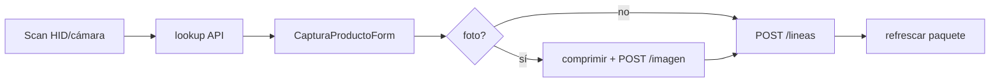

# Auditoría estática — Inventario / Captura PWA

READ-ONLY sobre `C:\Cursor-test-hot\Hot-click-dev\Hot_click_outlet`. Sin cambios.

---

## 1. Alcance y piezas

| Capa | Archivos clave |
|------|----------------|
| API | `InventarioPaqueteController`, `InventarioPaqueteService`, repos/modelos |
| Schema | `V131__paquete_inventario.sql` (+ mirror en `Actualizado.sql`) |
| UI | `AdminInventarioCaptura`, `AdminInventarioPaquetes`, `AdminInventarioPaqueteDetalle`, `AdminOfflineCola` |
| Offline | `capturaOffline.ts`, `capturaSyncService.ts`, `useOffline.ts` |
| Scan | `BarcodeHidInput`, `BarcodeCameraScan`, `barcodeHid` / `BarcodeNormalizer` |
| Distinto | `AdminInventario.tsx` = dashboard AI/ABC (no es captura de paquetes) |

---

## 2. Quién puede usarlo (ADMIN)

**Backend — estricto `ROLE_ADMIN`:**

```20:23:C:\Cursor-test-hot\Hot-click-dev\Hot_click_outlet\src\main\java\com\hotclick\controller\InventarioPaqueteController.java
@RestController
@RequestMapping("/api/inventario")
@PreAuthorize("hasRole('ADMIN')")
public class InventarioPaqueteController {
```

También en `SecurityAuthorizationRules`: `/api/inventario/**` → `hasRole(ROL_ADMIN)`.

**Frontend — más estrecho que “cualquier admin de tienda”:**

- Rutas `inventario/captura|paquetes|paquetes/:id` viven bajo `ITOnlyGuard` → `SuperAdminGuard` (`userRole === 'ADMIN'`).
- `EMPRENDEDOR` / equipo vendedor **no** entran a captura/paquetes (redirigen a `/admin`).
- `AdminOfflineCola` (`/admin/offline/cola`) está **fuera** de `SuperAdminGuard`: cualquier rol con acceso al shell `/admin` (incl. vendedores) puede abrir la UI de cola; el sync de captura seguirá fallando 403 si el JWT no es ADMIN.

Nav IT: `adminItJobs.ts` enlaza “Captura inventario” y cola offline para plataforma.

---

## 3. Modelo de paquetes (V131 + dominio)

Estados de paquete: `ABIERTO` → `CERRADO` → `ASIGNADO` (CHECK en SQL).

```5:51:C:\Cursor-test-hot\Hot-click-dev\Hot_click_outlet\src\main\resources\db\migration\V131__paquete_inventario.sql
CREATE TABLE IF NOT EXISTS hot_click_paquete_inventario_tb (
    ...
    CONSTRAINT chk_paquete_estado CHECK (estado IN ('ABIERTO', 'CERRADO', 'ASIGNADO'))
);
...
CREATE UNIQUE INDEX IF NOT EXISTS idx_paquete_linea_barcode_unico
    ON hot_click_paquete_linea_tb (fk_id_paquete, barcode)
    WHERE barcode IS NOT NULL;
```

Líneas: `LISTO` | `CONFLICTO`. Unique parcial barcode por paquete. Índice opcional unique `(empresa, barcode)` en producto solo si no hay duplicados previos (DO block).

Ciclo de negocio:

1. **Crear** paquete (`empresaId` **o** `nombreNegocioTemporal`) → `ABIERTO`.
2. **Capturar / importar** líneas solo en `ABIERTO`.
3. **Cerrar** → `CERRADO`.
4. **Asignar** (lock pesimista) → materializa productos + stock → `ASIGNADO`.
5. **Reabrir** solo desde `CERRADO` (no desde `ASIGNADO`).

Lookup: `EN_PAQUETE` → `EN_EMPRESA` (si hay empresa) → `EN_MAESTRO` → `NUEVO`.

Al agregar mismo barcode: **suma stock** (también recuperación ante `DataIntegrityViolationException`).

---

## 4. Flujo captura online (happy path)



En `AdminInventarioCaptura`: pistola (`BarcodeHidInput`) o cámara → `onScan` → form → `agregarLinea` + refresh. Cerrar / borrar línea solo online y con paquete `ABIERTO`. Wake Lock mientras `ABIERTO`. Layout “modo captura” si `?modo=captura` o PWA standalone (oculta sidebar/banners).

---

## 5. Flujo offline → sync

### Encolado (`capturaOffline`)

IndexedDB `hotclick-captura-offline` / store `capturaQueue`:

- `id` UUID, `tipo`, `paqueteId`, `payload`, `fotoBlob`, `intentos`, `estado`, `errorDetalle`
- Estados usados: `PENDIENTE` → `SINCRONIZANDO` → `OK`/`ERROR`
- Reintentable si `PENDIENTE|ERROR|SINCRONIZANDO` y `intentos < 5`

### Disparo en captura UI

```125:137:C:\Cursor-test-hot\Hot-click-dev\Hot_click_outlet\frontend\src\pages\admin\AdminInventarioCaptura.tsx
      if (!isOnline) {
        const blob = foto ? await comprimirImagenCaptura(foto) : null
        await encolarCaptura({
          tipo: 'CAPTURA_LINEA',
          paqueteId: paquete.id,
          payload: linea,
          fotoBlob: blob,
        })
        ...
```

Offline en scan: **no hay lookup**; fuerza `match: 'NUEVO'`.

### Sync (`capturaSyncService` + `useOffline`)

```19:54:C:\Cursor-test-hot\Hot-click-dev\Hot_click_outlet\frontend\src\services\capturaSyncService.ts
export async function procesarColaCaptura() {
  const pendientes = await getCapturaPendientes()
  ...
      if (item.fotoBlob) { ... subirImagen ... payload.imagenUrl = data.url }
      await inventarioPaqueteService.agregarLinea(item.paqueteId, payload)
      await actualizarCapturaEstado(item.id, 'OK', MARCA_POST_OK)
      await eliminarCapturaItem(item.id)
```

`useOffline`:
- `online` / montaje → `procesarCola()` (POS/general) + `procesarColaCaptura()`
- focus → solo recarga conteo (no sync)
- `navigator.onLine` (no es garantía de API reachable)

`AdminOfflineCola`: lista cola general + captura; sync manual; **captura no tiene Descartar/Reintentar** (solo la cola POS).

---

## 6. Escenarios offline / refresh / concurrencia

| Escenario | Comportamiento | Riesgo |
|-----------|----------------|--------|
| Sin red, paquete ya abierto | Encola línea; toast; **lista UI no muestra** items pendientes | Operador cree que no guardó; puede re-escanear |
| Crear paquete offline | `iniciarPaquete` siempre API | **Bloqueado** sin red |
| Lookup offline | Siempre `NUEVO` | Sin prefill maestro/empresa; posible form incompleto |
| Sync con paquete **CERRADO/ASIGNADO** | `agregarLinea` exige `ABIERTO` | Cola agota 5 intentos en ERROR |
| Refresh mid-sync | Item `SINCRONIZANDO` sigue reintentable | Diseño OK |
| Crash tras POST OK, antes de delete | Estado `OK` + `HC_POST_OK` | **Recovery rota**: `getCapturaPendientes` excluye `OK` → huérfano en IDB; no re-POST (bien) pero no limpia |
| Dos pestañas sync a la vez | Sin mutex en cliente | Mismo item encolado una vez: OK. Dos encolados del mismo barcode: stock se **suma** (idempotencia por barcode, no por queue id) |
| Asignar concurrente | `findByIdWithLineasForUpdate` PESSIMISTIC_WRITE, timeout 5s | Protege materialización |
| Agregar línea concurrente mismo barcode | Unique index + catch → suma stock | Correcto a nivel paquete |
| Refresh página captura | Paquete solo si `?paqueteId=`; cola IDB persiste | Si se creó paquete sin query param y se refresca, se pierde contexto de pantalla (paquete sigue en servidor) |
| Modo captura: OfflineBanner oculto | Layout no muestra banner global | Solo badge “Cola: N” en la página |
| Import Excel en detalle | Preview/confirm; max 500 líneas backend | UI no deshabilita import si no `ABIERTO` (API rechaza) |

---

## 7. Barcode

- FE/BE alineados: trim, mínimo 4 chars (`barcodeHid.ts` / `BarcodeNormalizer`).
- HID: Enter → normalizar → `onScan`.
- Cámara: `BarcodeDetector` nativo o ZXing; un código y cierra.
- Unique barcode empresa es **condicional** en V131: si ya hay duplicados históricos, el índice no se crea → materialización puede chocar o no con unique a nivel DB.

---

## 8. Riesgos (prioridad)

1. **`HC_POST_OK` vs filtro de pendientes** — La marca anti-doble-POST no se procesa en el loop de sync porque `esCapturaReintentable` excluye `OK`. Huérfanos “Sincronizado” en cola sin acción de descartar en captura.

2. **Cerrar/asignar con cola pendiente** — Sync posterior falla; stock no llega; intentos se agotan. No hay gate “pendientesCaptura > 0 ⇒ no cerrar”.

3. **Offline sin mirror local de líneas** — UX engañosa; riesgo de doble encolado del mismo producto (mitigado parcialmente por suma de barcode en servidor).

4. **Líneas sin barcode** — No hay unique; sync/import pueden crear duplicados reales.

5. **`CONFLICTO` sin productor automático** — Schema + `asignar` lo bloquean; no hay código que ponga `ESTADO_CONFLICTO` salvo el cliente vía `PaqueteLineaRequest.estado` (sanitizado en mapper). Estado “muerto” / surface de abuso si alguien POSTea `estado: CONFLICTO`.

6. **Cliente puede setear `estado` / `notasConflicto` en request** — `InventarioPaqueteMapper.aplicarRequest` acepta `req.getEstado()` sin whitelist → bypass de LISTO.

7. **Asignación parcial / fallos mid-loop** — Materializa línea a línea en una `@Transactional`; rollback total si falla a mitad (bien). Sin idempotency key de asignación: reintento tras éxito no aplica (ya `ASIGNADO`).

8. **Imágenes offline** — Blob en IDB; cuota disco; sin TTL. Sync: si sube imagen OK y falla `agregarLinea`, reintento re-sube (huérfanos en storage).

9. **Auth UI vs API en cola offline** — Vendedores ven `/admin/offline/cola` pero no pueden sync captura; fricción/confusión.

10. **Índice producto-empresa-barcode opcional** — En deploys con duplicados previos, `asignar`/`reusarProducto` dependen de queries, no de unique garantizado.

11. **Concurrencia cliente sync** — `useOffline` + botón cola + evento `online` pueden solapar `procesarColaCaptura` sin lock.

12. **`AdminInventario` (AI)** — Misma familia de nombre; otro producto (plan PYME). No confundir en QA.

---

## 9. Controles que sí están bien

- Autorización API solo ADMIN.
- Unique barcode por paquete + merge de stock (incl. race con unique violation).
- Lock pesimista en `asignar`.
- Límite import 500; sanitización de strings; normalización barcode FE/BE.
- Compresión JPEG ~1280/0.7 antes de cola/upload.
- Wake Lock en sesión de captura abierta.
- Tests: lookup/upsert/asignar conflictos/reabrir; `esCapturaReintentable` (incluye `SINCRONIZANDO`).

---

## 10. Mapa de rutas (citas)

```288:296:C:\Cursor-test-hot\Hot-click-dev\Hot_click_outlet\frontend\src\app\AppRoutes.tsx
            <Route path="inventario/captura" element={<AdminInventarioCaptura />} />
            <Route path="inventario/paquetes" element={<AdminInventarioPaquetes />} />
            <Route path="inventario/paquetes/:id" element={<AdminInventarioPaqueteDetalle />} />
          </Route>
        </Route>
        ...
        <Route path="offline/cola" element={<AdminOfflineCola />} />
```

`SuperAdminGuard`: solo `userRole === 'ADMIN'`.

---

### Veredicto

Módulo coherente para **digitalización de inventario en campo por ADMIN de plataforma**, con cola offline IndexedDB → sync de líneas + fotos, y materialización al asignar. Los huecos más relevantes son **UX offline sin buffer visible**, **cierre de paquete vs cola pendiente**, **recovery `HC_POST_OK` filtrado**, **ausencia de mutex multi-tab**, y **estado CONFLICTO / campo `estado` en request** sin pipeline real de resolución.