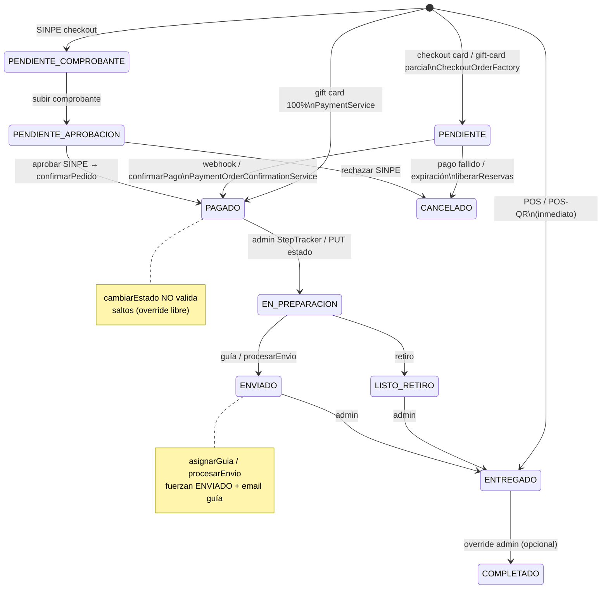
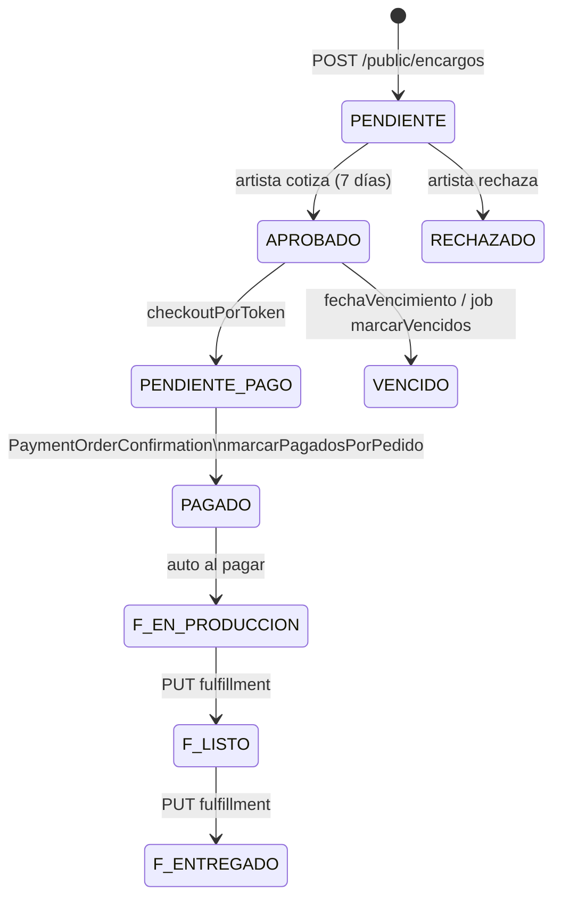
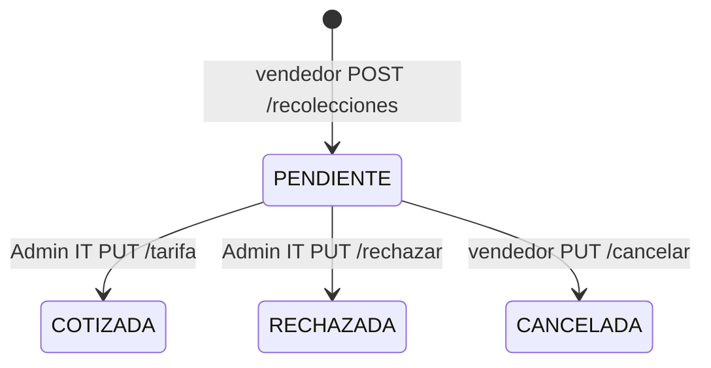

# Auditoría estática — PEDIDOS / FULFILLMENT

READ-ONLY. Alcance: `Hot_click_outlet` — backend `Pedido*`, `Encargo*`, `Recoleccion*`, `NotificacionEmail*` + frontend MisPedidos / Admin / prototipo seller.

---

## 1. Estados de pedido y transiciones

### Constantes canónicas (`estado_pedido`)

Definidas en `Constants.java`:

| Constante | Valor | Uso principal |
|-----------|-------|---------------|
| `PEDIDO_PENDIENTE` | `PENDIENTE` | Checkout card / pedido recién creado |
| `PEDIDO_PAGADO` | `PAGADO` | Pago capturado |
| `PEDIDO_EN_PREPARACION` | `EN_PREPARACION` | Fulfillment operativo (UI) |
| `PEDIDO_LISTO_RETIRO` | `LISTO_RETIRO` | Retiro en tienda |
| `PEDIDO_ENVIADO` | `ENVIADO` | Guía / envío |
| `PEDIDO_ENTREGADO` | `ENTREGADO` | Cierre operativo + finanzas |
| `PEDIDO_COMPLETADO` | `COMPLETADO` | Filtros admin / GMV queries |
| `PEDIDO_CANCELADO` | `CANCELADO` | Fallo pago / expiración / rechazo SINPE |
| `PEDIDO_PENDIENTE_COMPROBANTE` | `PENDIENTE_COMPROBANTE` | SINPE: espera upload |
| `PEDIDO_PENDIENTE_APROBACION` | `PENDIENTE_APROBACION` | SINPE: espera admin |
| `PEDIDO_CONFIRMADO` / `PEDIDO_PREPARANDO` | `CONFIRMADO` / `PREPARANDO` | En Constants; **casi no usados** en UI actual |

Default en entidad: `PENDIENTE` (`Pedido.java:65-66`).

**No hay máquina de estados en backend.** `PedidoService.cambiarEstado` asigna cualquier string (`PedidoService.java:67-70`).

### Diagrama — pedido marketplace / admin (happy path + ramas)



### Timelines UI (cliente vs admin)

- Cliente envío: `PENDIENTE → PAGADO → EN_PREPARACION → ENVIADO → ENTREGADO` (`PedidoTimeline.tsx:5-10`)
- Cliente retiro: `… → LISTO_RETIRO → ENTREGADO` (`PedidoTimeline.tsx:12-17`)
- Admin añade `COMPLETADO` al final (`ordenesHelpers.ts:23-38`)

### Encargo (ciclo aparte, puede enlazar `Pedido`)



Estados: `EncargoPersonalizado.java:14-30`. Fulfillment solo si `estado == PAGADO` (`EncargoService.java:273-276`).

### Recolección (logística GAM, no es pedido)



`SolicitudRecoleccion.java:12-15`, `RecoleccionService.java:79-121`.

---

## 2. Flujos

### A) Compra marketplace (checkout → pago → fulfillment)

1. **Checkout** `PaymentService.checkout` (`PaymentService.java:55-74`):
   - Reserva stock (`StockReservationService.reserveForCheckout`)
   - Crea `Pedido` en `PENDIENTE` (`CheckoutOrderFactory`)
   - Crea sesión Stripe/ONVO/Tilopay o rama gift card / SINPE
2. **Confirmación pago** `PaymentOrderConfirmationService.confirmarPedido` (`PaymentOrderConfirmationService.java:34-61`):
   - Idempotente si ya `PAGADO`
   - `confirmAndConsumeStock` → `estadoPedido = PAGADO`
   - Cupón / gift card / `encargoService.marcarPagadosPorPedido`
   - `PaymentNotificationsFacade.onPedidoConfirmado` → avisos + n8n + wallet
3. **Fulfillment admin** `AdminOrders` / `StepTracker`:
   - Cambio estado vía `PUT /api/pedidos/{id}/estado` (`PedidoController.java:103-119`)
   - Envío: `PUT …/envio` o `…/guia` → fuerza `ENVIADO` + Correos CR URL (`PedidoService.java:111-140`)
4. **Cliente** ve historial en `/mis-pedidos` → `orderService.getByUser` (`MisPedidosPage.tsx:17-42`)

Orígenes especiales: POS/POS-QR crean pedido ya `ENTREGADO` y descuentan stock POS (`PosVentaService` / `PosQrPedidoFactory`).

### B) Pedido admin / manual

- `POST /api/pedidos/manual` (`PedidoController.java:48-57`) → `PedidoManualFactory` (`PedidoManualFactory.java:36-58`)
- Estado inicial configurable (`dto.estadoPedido` o `PENDIENTE`); default pago `SINPE`, envío `RETIRO_EN_TIENDA`
- **No reserva stock** en el factory (solo arma ítems y totales)
- UI: `CrearPedidoModal` desde `AdminOrders` / `SistemaVentasPedidos`
- Routing: `AdminPedidosRoute` → rol sistema → `SistemaVentasPedidos`, else `AdminOrders` (`routeGuards.tsx:89-91`)

También existe `POST /api/pedidos` genérico que fuerza `PENDIENTE` (`PedidoController.java:59-67`) + Telegram en `crearPedido`.

### C) Encargo personalizado

| Paso | API | Actor |
|------|-----|-------|
| Crear | `POST /api/public/encargos` | Cliente (producto RANGO/COTIZACION) |
| Ver estado | `GET /api/public/encargos/{token}` + UI `/encargo/:token` | Público |
| Aprobar/rechazar | `PUT /api/encargos/{id}/aprobar\|rechazar` | Tenant artista |
| Pagar | `POST /api/public/encargos/{token}/checkout` → `PaymentService.checkout` | Cliente |
| Fulfillment | `PUT /api/encargos/{id}/fulfillment` | Tenant |

Checkout de encargo fija método envío en UI pública a `RETIRO_EN_TIENDA` + Stripe (`EncargoPublicPage.tsx:29-36`). Tras pago: `ESTADO_PAGADO` + `FULFILLMENT_EN_PRODUCCION` (`EncargoService.java:238-247`).

Rutas admin: `/admin/encargos`; prototipo seller: `EncargosPage` / `EncargosSellerPage`.

### D) Recolección (pickup logístico HOTCLICK)

- Vendedor: `POST /api/recolecciones` (solo zona GAM) (`RecoleccionService.java:47-67`)
- Aviso a Admin IT (`moderacionAdminAvisoService.avisarRecoleccion`)
- Admin IT cotiza/rechaza; vendedor cancela si aún `PENDIENTE`
- **No crea `Pedido`**, no toca stock ni pago de catálogo
- UI: `/admin/recolecciones` + prototipo `RecoleccionPage` / `RecoleccionSellerPage`

---

## 3. Notificaciones email / WhatsApp

### Pedido — fachada

`NotificacionEmailService` delega a `NotificacionPedidoEmailSender` (`NotificacionEmailService.java:58-104`).

| Evento | Disparador | Email | WhatsApp (Meta API) |
|--------|------------|-------|---------------------|
| Confirmación venta | `VentaAvisoService` ← pago confirmado / POS / storefront guest | Cliente + emprendedor + Admin IT | Cliente + emprendedor + Admin IT (`NotificacionPedidoEmailSender.java:28-34`) |
| Guía / envío | `asignarGuia` / `procesarEnvio` | Cliente | `enviarGuiaAsignada` |
| Seguimiento | `cambiarEstado` **solo si hay nota**; o `POST …/notificar` sync | Cliente | *(seguimiento sync es email-only)* |
| Pago fallido | rechazo SINPE / failure handler | Cliente | — |
| Telegram | `PedidoService.crearPedido` + tenant `TelegramNotificacionClienteService` | — | canal Telegram (no WA) |

WhatsApp backend: `WhatsAppService.java:35-63` (plantillas `CONFIRMACION_PEDIDO`, `GUIA_ASIGNADA`; simulado si faltan credenciales).

### WhatsApp “cliente” en admin (no API Meta)

Deep link `wa.me` con mensaje armado en frontend (`ordenesHelpers.ts:156-171`, `OrderCardExpanded.tsx` / `AdminOrderCard.tsx`). No llama al backend.

### Encargo — `EncargoEmailSender`

| Evento | Destinatario |
|--------|--------------|
| Recibido | Cliente + artista (`EncargoEmailSender.java:22-91`) |
| Aprobado / rechazado / vencido | Cliente (link `/encargo/{token}`) |
| Telegram | `notificarSolicitudEnviada` al crear (`EncargoService.java:445-450`) |

### Recolección

Sin email Resend dedicado: avisos de moderación in-app (`ModeracionAvisoService` / `ModeracionAdminAvisoService`).

### Otros

- n8n: pedido nuevo (al pagar) y entregado (`PaymentNotificationsFacade` / `PedidoService.cambiarEstado` ENTREGADO)
- Webhooks tenant: `pedido.creado`, `pedido.pagado`

---

## 4. Dependencias stock, pago, envío

### Stock

Documentado en `PaymentService.java:25-28`:

```
checkout → reserve (stockReservado)
confirmar → consume (stockActual ↓, reserva liberada)
cancel/fail/expire → liberarReservas
```

- Encargo checkout reutiliza el mismo pipeline de pago → misma reserva/consumo
- Pedido manual / `cambiarEstado` **no** mueven stock
- POS descuenta vía `StockService.descontarPorVentaPOS`

### Pago

- Card/ONVO/Tilopay/Stripe: `PENDIENTE` → webhook → `confirmarPedido` → `PAGADO`
- Gift card total: `PAGADO` inmediato en checkout
- SINPE: `PENDIENTE_COMPROBANTE` → `PENDIENTE_APROBACION` → `aprobar` → `confirmarPedido` (`SinpeComprobanteService.java:114`)
- Expiración: cancela pedido `PENDIENTE` y libera stock (`PaymentExpirationCleanupService`)

### Envío

| Método | Constante | Efecto fulfillment |
|--------|-----------|-------------------|
| Domicilio | `ENVIO_A_DOMICILIO` | Tracker envío; `ENVIADO` exige guía en UI admin |
| Retiro | `RETIRO_EN_TIENDA` | Tracker retiro → `LISTO_RETIRO` |

`asignarGuia` / `procesarEnvio` siempre setean  
`urlTracking = https://rastreo.correos.go.cr/?codigo=…` (`PedidoService.java:115-116`).  
Email de guía distingue Correos vs link externo en builder (según CLAUDE / builders).

Recolección es canal logístico paralelo (GAM), no escribe `numero_guia` del pedido.

---

## 5. Escenarios de cobertura (tests + gaps)

### Cubierto (backend)

| Área | Evidencia |
|------|-----------|
| `PedidoService` cambiarEstado / guía / envío / n8n ENTREGADO | `PedidoServiceTest.java` |
| Auth tenant guía/envío emprendedor | `EmprendedorPedidoTest.java` |
| Confirmación pago + stock + idempotencia | `PaymentServiceTest`, `PaymentServiceF37Test` |
| Expiración Tilopay → CANCELADO | `PaymentExpirationCleanupTilopayTest` |
| Encargo dominio / service | `EncargoServiceTest`, `EncargoPersonalizadoDomainTest` |
| Recolección GAM + tarifa admin | `RecoleccionServiceTest` |
| Avisos venta → email confirmación | `VentaAvisoServiceTest` |
| E2E mis-pedidos / copy compra | `frontend/tests/mis-pedidos.spec.ts`, `comprar-pedido-copy.spec.ts` |

### Gaps / riesgos de regresión

1. **Sin validador de transiciones** en `cambiarEstado` — saltos `PENDIENTE→ENTREGADO`, `CANCELADO→PAGADO`, etc. posibles vía API/override UI.
2. **Constantes huérfanas** `CONFIRMADO` / `PREPARANDO` vs UI `EN_PREPARACION`.
3. **Pedido manual sin stock** — puede sobrevender.
4. **Prototipo seller** colapsa estados a 3 labels (`Pendiente|Enviado|Entregado`) — pierde `EN_PREPARACION` / SINPE (`pedidosVendedorApi.ts:7-11`).
5. **Seguimiento email** solo si `nota` no vacía (`PedidoService.java:79-80`); botón “Email cliente” usa sync sin nota.
6. **Encargo público** checkout hardcodea retiro + Stripe — no cubre domicilio/SINPE en esa página.
7. **Recolección** sin tests de cancelación/rechazo en el extracto visto; sin vínculo a pedido.
8. **Duplicación de UIs** admin vs prototipo (sección 6) sin suite e2e unificada de “marcar enviado”.

---

## 6. Duplicación admin vs prototipo vendedor

| Capacidad | Admin (`AdminOrders` / `SistemaVentasPedidos`) | Prototipo (`PedidosPage` + `PedidoDetallePage`) |
|-----------|-----------------------------------------------|--------------------------------------------------|
| Fuente datos | `orderService.getAll()` | Misma API vía `cargarPedidosVendedor` → `orderService.getAll()` (`pedidosVendedorApi.ts:58-60`) |
| Ruta | `/admin/pedidos` (`AdminPedidosRoute`) | Seller `/…/pedidos`, Emp `/emprendedor/pedidos` |
| Estados UI | Tracker completo + filtros 9 estados (`ordenesHelpers.ts:6`) | 3 estados Figma (`estadoFigma`) |
| Acciones | Estado, guía, costo envío, nota+email, WA link, delete, crear manual, export | Solo **Confirmar envío** → `updateStatus(ENVIADO)` (`pedidosVendedorApi.ts:63-65`) |
| Detalle | Expandible en card | Página dedicada `PedidoDetallePage` |
| Encargos / recolección | `/admin/encargos`, `/admin/recolecciones` | Páginas mirror en prototipo compartido |
| Sistema IT | `SistemaVentasPedidos` tabs pedidos+ventas | N/A |

**Conclusión:** no son dos backends; son **dos shells UI** sobre la misma API. El prototipo es un recorte de fulfillment (solo `ENVIADO`) pensado Figma; el admin es el panel operativo completo. Riesgo: divergencia de copy/estados y doble mantenimiento de listados (`PedidosListaVista` compartida vs `AdminOrderCard`).

MisPedidos (comprador) es un tercer consumidor: solo lectura + timeline, sin acciones de fulfillment (`MisPedidosPage.tsx`).

---

## Mapa rápido de archivos clave

| Rol | Path |
|-----|------|
| API pedidos | `src/main/java/com/hotclick/controller/PedidoController.java` |
| Dominio / estados | `…/model/Pedido.java`, `…/utils/Constants.java:63-101` |
| Servicio | `…/service/PedidoService.java` |
| Pago → PAGADO | `…/payment/PaymentOrderConfirmationService.java` |
| Email fachada | `…/NotificacionEmailService.java` + `…/email/NotificacionPedidoEmailSender.java` |
| Encargo | `EncargoPublicController`, `EncargoAdminController`, `EncargoService` |
| Recolección | `RecoleccionController`, `RecoleccionService` |
| Admin UI | `frontend/src/pages/admin/AdminOrders.tsx`, `ordenes/*` |
| Route gate | `frontend/src/app/routeGuards.tsx:89-91` |
| Prototipo | `frontend/src/prototipo/compartido/PedidosPage.tsx`, `PedidoDetallePage.tsx` |
| Público encargo | `frontend/src/pages/EncargoPublicPage.tsx`, ruta `AppRoutes.tsx:192` |

---

**Hallazgo central:** el fulfillment de pedidos es **string-driven y UI-guided**, no una state machine server-side; pago y stock están bien acoplados en checkout, pero pedidos manuales y cambios de estado admin quedan fuera de ese contrato. Encargos y recolecciones son flujos vecinos con sus propios estados, enlazados al pedido solo cuando el encargo paga.