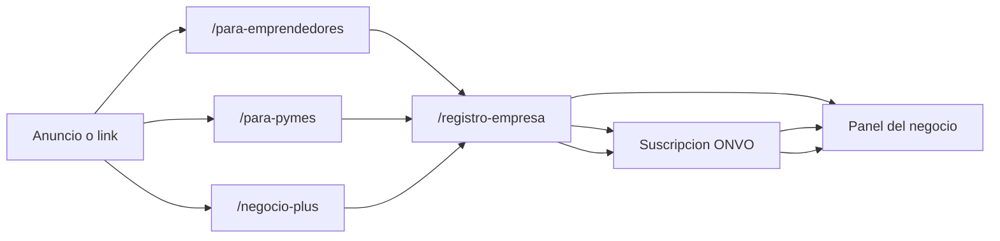

# Brief: tres landings de alta de negocio

Idea aprobada para diseño en Figma y desarrollo posterior (Claude Code). No incluye código ni archivo de Figma.

## Por qué separarlas

Hoy hay una sola página, [`/emprende`](../../frontend/src/pages/emprende/EmprendeLanding.tsx). Mezcla los tres planes y todos los botones van a [`/registro-empresa`](../../frontend/src/pages/RegistroEmpresaPage.tsx). El copy de planes dice que PYME y Negocio Plus se eligen después, en Sistema ([`es.json`](../../frontend/src/i18n/locales/es.json), clave `emprende.planesSub`).

Eso sirve para quien todavía no sabe qué plan quiere. No sirve para un anuncio: alguien que llega por “PYME” ve el plan gratis al lado y se registra sin pagar.

Cada landing habla con una sola persona y tiene un solo botón principal.

Precios y límites ya definidos en base (V114/V115), no se inventan:

- **Emprendedor:** ₡0/mes, comisión 8% por venta (mínimo ₡400). Hasta 50 productos, 2 usuarios, 1 bodega y 1 caja. Pagos con tarjeta y SINPE, envíos en Costa Rica, reportes básicos. Cupo de los primeros 70.
- **PYME:** ₡9.900/mes + 4% por venta. Hasta 500 productos, 5 usuarios, 2 bodegas y 2 cajas. Compras e inventario, gift cards, reportes avanzados, consultas con Hot (IA, 80 créditos/mes).
- **Negocio Plus:** ₡24.900/mes + 4% por venta. Productos, usuarios, bodegas y cajas sin tope. Todo lo de PYME, más varias sucursales, pedidos por local, CRM e IA sin límite de créditos.

## Análisis por audiencia

### 1. Emprendedor — objetivo: cuenta creada, sin cobro de membresía

**Quién:** persona que vende en feria, Instagram o WhatsApp y todavía no tiene equipo ni local. Quiere publicar y cobrar sin mensualidad.

**Promesa:** “Publicá y cobrá en HotClick. Sin mensualidad: solo una comisión cuando vendés.”

**Miedo a responder en la página:** “¿Me van a cobrar la tarjeta al registrarme?” No. La membresía es ₡0. HotClick se queda un 8% de cada venta (mínimo ₡400), que cubre pasarela y plataforma.

**CTA único:** “Crear mi negocio” → `/registro-empresa` sin paso de pago.

**Qué no decir:** no abrir con PYME ni Negocio Plus, no tabla comparativa, no “elegí tu plan”. Un enlace chico al pie: “Si ya tenés equipo o local, mirá PYME”.

**Si el cupo de 70 está lleno:** la página lo dice arriba (ya existe el aviso en `EmprendeCupoBanner`) y el botón principal deja de prometer gratis. Manda a `/para-pymes`. El registro no se cierra; lo que se cierra es la membresía ₡0.

**Éxito:** porcentaje de visitas que terminan el registro. No se mide suscripción.

### 2. PYME — objetivo: suscripción de ₡9.900/mes

**Quién:** negocio chico que ya vende, con 2 a 5 personas, stock en una o dos bodegas, y que se le queda corto el cuaderno o el Excel.

**Promesa:** “Operá el negocio en un solo panel: equipo, inventario y caja, por ₡9.900 al mes.”

**Miedo:** “¿Por qué pagar si el otro plan es gratis?” Porque el gratis cobra 8% y se queda en 50 productos y sin módulo de compras. PYME baja la comisión a 4% y agrega equipo, compras, gift cards e IA. La página muestra un ejemplo corto: en una venta de ₡50.000, Emprendedor deja ₡4.000 de comisión y PYME deja ₡2.000, más la mensualidad. Quien vende seguido recupera los ₡9.900; quien vende poco no es el cliente de esta página.

**CTA único:** “Suscribirme a PYME — ₡9.900/mes”. Precio visible en el primer pantallazo, no escondido.

**Qué no decir:** no destacar el plan gratis como alternativa equivalente. Enlace secundario: “Recién arranco, sin mensualidad”.

**Éxito:** suscripción ONVO activa en plan PYME. El registro solo es el paso previo.

### 3. Negocio Plus — objetivo: suscripción de ₡24.900/mes

**Quién:** dueño con más de un local, o un equipo que ya no cabe en 5 usuarios. Le importa ver pedidos por sucursal y el historial de clientes.

**Promesa:** “Todas las sucursales en un panel. Pedidos por local, equipo sin tope y CRM.”

**Miedo:** “¿En qué se diferencia de PYME, que sale más barato?” En tres cosas que PYME no tiene: varias sucursales, CRM de clientes, y sin tope de productos, usuarios ni créditos de IA. Si tiene un solo local y menos de 5 personas, esta página le dice que PYME le alcanza.

**CTA único:** “Suscribirme a Negocio Plus — ₡24.900/mes”.

**Qué no decir:** no repetir el discurso de “publicá tu primer producto”. Esta persona ya opera.

**Éxito:** suscripción ONVO activa en plan NEGOCIO_PLUS.

## Estructura para Figma (las tres, mismo esqueleto)

Misma grilla, tipografía y componentes de HotClick. Cambia el tono, no el sistema.

1. **Barra:** logo, enlace “Ya tengo cuenta”, y el CTA de esa página.
2. **Hero:** una frase de promesa, una línea de precio o de “sin mensualidad”, un botón. Foto de feria o comercio real (la galería de `/emprende` ya apunta a ese mundo).
3. **Para quién es / para quién no:** tres viñetas. En Plus, la viñeta “un solo local” apunta a PYME.
4. **Qué incluye este plan:** solo los puntos de ese plan, sacados del copy actual de `emprende.plan*Puntos`. Sin las otras dos tarjetas.
5. **Cómo entra:** Emprendedor = registrarse y publicar. PYME y Plus = registrarse, pagar la mensualidad con la pasarela que ya usa el panel (ONVO), y entrar al panel con ese plan.
6. **Precio:** bloque grande. Emprendedor muestra ₡0 y la comisión 8%. Las de pago muestran mensualidad + 4%.
7. **Preguntas de esa audiencia** (4 como máximo), no el FAQ genérico de las tres.
8. **Cierre:** el mismo CTA del hero.

Tono visual, para que no parezcan la misma página recoloreada:

- Emprendedor: puesto de feria, primer producto, lenguaje de “empezar”.
- PYME: mostrador, equipo chico, inventario.
- Negocio Plus: dos locales, lista de sucursales, más aire y menos adjetivos.

Mobile primero: el precio y el botón tienen que verse sin scroll largo en el hero.

## Qué haría Claude Code después (fuera de este brief)

No se construye en este paso. Cuando se pase a desarrollo:

- Rutas públicas nuevas: `/para-emprendedores`, `/para-pymes`, `/negocio-plus`. [`/emprende`](../../frontend/src/pages/emprende/EmprendeLanding.tsx) queda como puerta corta con tres enlaces, no como la página de venta.
- El alta sigue siendo [`/registro-empresa`](../../frontend/src/pages/RegistroEmpresaPage.tsx). Las de pago agregan la intención de plan (`PYME` o `NEGOCIO_PLUS`) para que, al terminar el registro, el flujo de suscripción ONVO que ya existe en el panel cobre ese plan. Emprendedor no abre ese flujo.
- Textos en `es.json`, sin hardcodear precios en el componente: leerlos de las mismas claves o del API de planes, para no desalinear landing y base.
- La landing de Emprendedor reutiliza el cupo público (`/public/emprende/cupos`). Si no hay cupos, el CTA cambia a PYME.

## Fuera de este alcance

- No rediseñar el formulario de registro ni el checkout ONVO.
- No cambiar precios, comisiones ni features del plan.
- No cuarta landing ni comparador de tres columnas como página principal.
- No implementar ni dibujar Figma hasta que este brief se apruebe.

## Cómo pasar esto al siguiente paso

1. **Figma:** usar la sección “Estructura para Figma” + tono visual por audiencia. Tres frames (mobile + desktop) con el mismo esqueleto.
2. **Claude Code:** pegar este archivo completo y pedir las rutas `/para-emprendedores`, `/para-pymes` y `/negocio-plus` según la sección de desarrollo, sin tocar precios ni el checkout ONVO.
