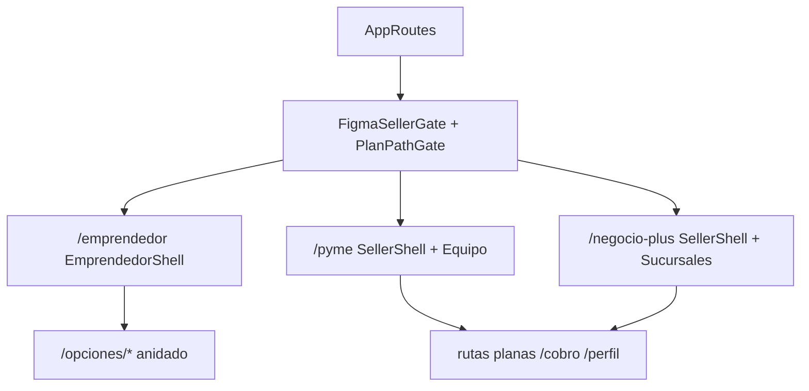

# FRONTEND AUDIT — HOTCLICK Seller (Emprendedor / PYME / Negocio Plus)

**Fecha:** 2026-09-03  
**Alcance:** Solo investigación y documentación. Cero cambios de código en esta entrega.  
**Árbol principal:** `Hot_click_outlet/frontend/src/prototipo/`  
**Fuera de alcance de implementación:** marketplace `/productos`, admin POS (salvo redirects), login/registro globales.

---

## 1. Resumen ejecutivo

La experiencia seller vive en tres prefijos (`/emprendedor`, `/pyme`, `/negocio-plus`) detrás de `FigmaSellerGate` + `PlanPathGate`. Emprendedor tiene shell y rutas propias (settings anidados en `/opciones/*`); PYME y Negocio Plus comparten `SellerRoutes` + `SellerShell`, con extras `equipo` y `sucursales` respectivamente.

**Fortalezas:** kit de motion centralizado (`formularioMotionTokens` + springs/stagger), `FormularioPorPasos` con anti-doble-submit, `PantallaExitoWizard`, empty states conversacionales, tokens de marca, Playwright de wizards en móvil.

**Deuda crítica:** Service Worker en producción recarga en silencio (riesgo de perder wizards mid-flow); Docker no recompila el frontend (depende de `static/` commiteado); doble kit UI emprendedor vs compartido; páginas forkeadas; feedback toast/inline inconsistente; modal de sucursales incompleto en a11y; bottom nav ilegible + sin safe-area.

**Módulos inexistentes en seller routes:** Inventario dedicado, Clientes CRM, Ventas como módulo, Marketing. POS redirige a `/admin/pos`.

---

## 2. Arquitectura actual

### Stack

| Pieza | Versión / ubicación | Rol |
|-------|---------------------|-----|
| React / React DOM | ^19.2.5 | UI |
| react-router-dom | ^7.15.0 | Rutas |
| Zustand | ^5.0.13 | Auth/tenant/cart |
| TanStack Query | ^5.100.9 | Server state (`App.tsx`) |
| Tailwind CSS | ^4.2.4 | Estilos |
| Framer Motion | ^12.38.0 | Animaciones seller + storefront |
| vite-plugin-pwa | ^1.3.0 | PWA / Workbox |
| Playwright | ^1.62.1 | E2E |
| Vite | ^8.0.10 | Build → `../src/main/resources/static` |

### Diagrama de montaje

### Capas relevantes

| Capa | Path |
|------|------|
| Entry | `src/main.tsx` — StrictMode, PostHog, Sentry, `registerSW`, i18n |
| App shell | `src/App.tsx` — QueryClient, ToastProvider, Router, SW refresh, Suspense |
| Rutas top | `src/app/AppRoutes.tsx` — lazy areas seller |
| Gate plan | `src/app/PlanPathGate.tsx`, `src/utils/planPaths.ts` |
| Emprendedor | `src/prototipo/emprendedor/*` |
| PYME / Plus compartido | `src/prototipo/compartido/*` |
| PYME extra | `src/prototipo/pyme/EquipoPage.tsx` |
| Plus extra | `src/prototipo/negocio-plus/SucursalesPage.tsx` |
| Motion kit | `src/prototipo/compartido/motion/*` |
| Tokens CSS | `src/styles/hotclick-tokens.css` |
| API | `src/services/api.ts` + services por dominio |
| Marketplace/admin | `src/pages/**` (no es el shell Figma seller) |

### Providers

`HelmetProvider` → `QueryClientProvider` (staleTime 30s, retry 1) → `ToastProvider` → `BrowserRouter` → chrome global. PYME/Plus añaden `SellerPlanProvider`. Emprendedor no usa plan provider local.

### Convenciones

- Prefijo plan: default `/emprendedor`; `PYME` → `/pyme`; `NEGOCIO_PLUS` → `/negocio-plus`.
- Emprendedor anida settings; PYME/Plus aplanan.
- Capa A (crear/editar) y Capa B (confirmaciones) usan wizards/motion; Capa C (listados) usa `EntradaPagina` + `ListaStagger`, no multi-step.

---

## 3. Mapa de rutas

Leyenda columnas: **Motion** = kit seller presente; **Loading/Error/Success** = patrón dominante; **Responsive** = shell mobile-first `max-w-md` + sidebar `md+`.

**Permisos:** JWT vivo + rol vendedor sistema + plan alineado al prefijo (`PlanPathGate`). ADMIN → `/admin`; POS → `/admin/pos`.

### 3.1 Emprendedor (`EmprendedorRoutes.tsx`)

| Rol | Ruta | Componente | Layout | Permisos | Motion | Loading | Error | Success | Responsive |
|-----|------|------------|--------|----------|--------|---------|-------|---------|------------|
| Emp | `/emprendedor` | `MenuPage` | Shell+nav | plan emprendedor | Entrada+ListaStagger | — | — | — | bottom nav |
| Emp | `/emprendedor/productos` | `ProductosPage` | Shell+nav | idem | Entrada+Lista | texto | inline | — | chips scroll |
| Emp | `/emprendedor/productos/vacio` | `ProductosVacioPage` | Shell+nav | idem | Entrada+empty | — | — | empty CTA | ok |
| Emp | `/emprendedor/productos/nuevo` | `ElegirTipoProductoPage` | Shell+nav | idem | Entrada+TarjetaOpcion | — | — | — | ok |
| Emp | `…/nuevo/catalogo\|personalizado` | `AgregarProductoPage` | Shell+nav | idem | FormularioPorPasos+Campo+Exito | enviando | inline | PantallaExito | sticky CTA |
| Emp | `/emprendedor/productos/:id/editar` | `EditarProductoPage` | Shell | idem | wizard+exito | texto | inline | PantallaExito | sticky |
| Emp | `/emprendedor/productos/:id/eliminar` | `ConfirmarEliminacionPage` | Shell | idem | Entrada+hover/tap CTA | — | inline | navigate | ok |
| Emp | `/emprendedor/encargos` | `EncargosPage` | Shell+nav | idem | Entrada | — | — | — | ok |
| Emp | `/emprendedor/recoleccion` | `RecoleccionPage` | Shell+nav | idem | Entrada+form | — | — | — | ok |
| Emp | `/emprendedor/tienda*` | Tienda/Carrito/Detalle | Shell±nav | idem | Entrada parcial | — | — | — | ok |
| Emp | `/emprendedor/reportes` | `ReportesPage` | Shell+nav | idem | Entrada | — | — | — | ok |
| Emp | `/emprendedor/opciones` | `OpcionesPage` | Shell+nav | idem | Entrada+Lista | — | — | — | ok |
| Emp | `/emprendedor/opciones/perfil` | `PerfilPage` | Shell+frame | idem | Frame+wizard | — | toast | toast | ok |
| Emp | `/emprendedor/opciones/notificaciones` | `NotificacionesPage` | Shell+frame | idem | Frame | — | — | — | ok |
| Emp | `/emprendedor/opciones/cobro*` | Cobro / AgregarMetodo | Shell+frame | idem | Frame+wizard/Lista | texto | toast | toast/exito | ok |
| Emp | `/emprendedor/opciones/ayuda` | `AyudaPage` | Shell+frame | idem | **doble Entrada** | — | — | — | accordion |
| Emp | `/emprendedor/opciones/bodegas*` | Bodegas / Nueva | Shell+frame | idem | Frame+wizard/empty | texto | inline | navigate | ok |
| Emp | `/emprendedor/opciones/negocio` | `DatosNegocioPage` | Shell+frame | idem | wizard | — | toast | toast | ok |
| Emp | `/emprendedor/opciones/plan*` | Planes / Actualizado | Shell | idem | Entrada+wizard/pulse | poll | inline | PantallaExito | ok |
| Emp | `/emprendedor/pedidos*` | Pedidos / Detalle | Shell+frame | idem | Entrada | texto | inline | — | ok |
| Emp | `/emprendedor/pos*` | redirect | — | — | — | — | — | — | → `/admin/pos` |
| Emp | `/emprendedor/login\|registro` | redirect | — | — | — | — | — | — | globals |

### 3.2 PYME (`PymeRoutes` → `SellerRoutes` + `equipo`)

| Rol | Ruta | Componente | Layout | Permisos | Motion | Loading | Error | Success | Responsive |
|-----|------|------------|--------|----------|--------|---------|-------|---------|------------|
| PYME | `/pyme` | `MenuPage` | Seller+nav | plan PYME | Entrada+Lista | — | — | — | bottom nav |
| PYME | `/pyme/productos*` | Productos / Form / Detalle / Eliminar | Seller±nav | idem | Entrada+wizard+exito | texto | inline | PantallaExito | sticky |
| PYME | `/pyme/equipo` | `EquipoPage` | Seller | idem | Entrada+wizard+exito | texto | toast/inline | PantallaExito | ok |
| PYME | `/pyme/cobro*` `/perfil` `/bodegas*` `/negocio` `/plan*` `/pedidos*` `/ayuda` … | compartido/* | Seller | idem | kit compartido | mixto | toast/inline | mixto | flat paths |
| PYME | `/pyme/pos*` | redirect | — | — | — | — | — | — | → admin POS |

### 3.3 Negocio Plus

Igual que PYME vía `SellerRoutes`, con:

| Rol | Ruta | Componente | Layout | Permisos | Motion | Loading | Error | Success | Responsive |
|-----|------|------------|--------|----------|--------|---------|-------|---------|------------|
| Plus | `/negocio-plus/sucursales` | `SucursalesPage` | Seller | plan Plus | Entrada+Lista+wizard+exito | texto | toast | PantallaExito/toast | modal incompleto a11y |
| Plus | *(sin `/equipo`)* | — | — | — | — | — | — | — | — |

### 3.4 Rutas relacionadas (no prefijo exacto)

| Ruta | Comportamiento |
|------|----------------|
| `/prototipo/*` | Redirect a bases de producción (`destinoPrototipo`) |
| `/admin/*` (vendedor) | `AdminRoleSwitch` remapea a prefijo plan salvo POS/config/billing/copilot/mi-empresa/ayuda |
| `/tienda/:slug/*` | Storefront público (otro shell) |
| `/visitante/*` | Prototipo comprador |

---

## 4. Auditoría Emprendedor

### Módulos

| Módulo | Estado | Crear | Editar | Eliminar | Activar/Desactivar | Buscar/Filtrar | Confirmar | Notas |
|--------|--------|-------|--------|----------|--------------------|----------------|-----------|-------|
| Dashboard / Menú | Sí | — | — | — | — | — | — | `MenuPage` tiles |
| Productos | Sí | Sí | Sí | Sí | — | filtros chips | eliminar | fork vs compartido |
| Inventario | No dedicado | — | — | — | — | — | — | stock en wizard producto |
| Bodegas | Sí | Sí | No UI | No UI | — | — | — | listado+nueva |
| Sucursales | No | — | — | — | — | — | — | solo Plus |
| Equipo | No | — | — | — | — | — | — | solo PYME |
| Clientes | No | — | — | — | — | — | — | — |
| Ventas / POS | Redirect | — | — | — | — | — | — | `/admin/pos` |
| Pedidos | Sí | — | estado envío | — | marcar enviado | filtros | confirm envío | página forkeada |
| Cobros | Sí | Sí | Sí | pred. | predeterminado | — | modal pred. | wrappers → compartido |
| Plan | Sí | cambiar | — | — | — | — | ONVO/poll | `PlanesPage` paralelo |
| Marketing | No | — | — | — | — | — | — | — |
| Reportes | Sí (light) | — | — | — | — | — | — | prototipo |
| Config / Negocio | Sí | — | Sí | — | — | — | wizard | DatosNegocio |
| Perfil | Sí | — | Sí | — | — | — | — | toast |
| Encargos / Recolección | Sí | flujos | — | — | — | — | — | features compartidas |
| Tienda preview | Sí | — | — | — | — | — | — | carrito demo |
| Ayuda / Consultas | Sí | — | — | — | — | accordion | — | a11y mejor que PYME FAQ |

### Problemas específicos Emprendedor

- Doble kit: `emprendedor/ui` (`BotonPrimario`, `CampoTexto`) vs compartido.
- Double `EntradaPagina` en `AyudaPage` bajo `EmprendedorPageFrame`.
- Paths `/opciones/*` vs flat en otros planes → docs y deep-links asimétricos.
- Páginas grandes duplicadas: Productos, Pedidos, Eliminar, Bodegas list, Planes.

---

## 5. Auditoría PYME

### Módulos

| Módulo | Estado | Operaciones clave |
|--------|--------|-------------------|
| Menú / Productos / Tienda / Reportes / Opciones | Sí | Shared `SellerRoutes` |
| Equipo | Sí (único) | Invitar (wizard), quitar (confirm+toast), roles en invite |
| Bodegas / Cobro / Negocio / Plan / Pedidos / Perfil | Sí | Flat paths |
| Sucursales / Inventario / Clientes / Marketing | No | — |
| POS | Redirect admin | — |

### Problemas específicos PYME

- `EquipoPage`: pelea Tailwind `hover:-translate-y` + Framer `whileHover`/`whileTap` en CTAs.
- `AyudaPage` compartido: accordion sin `aria-expanded` (Emprendedor sí lo tiene).
- Misma deuda de skeletons / feedback que el kit compartido.

---

## 6. Auditoría Negocio Plus

### Módulos

Igual que PYME **sin** Equipo; **con** Sucursales.

| Operación Sucursales | Presente |
|----------------------|----------|
| Listar / empty | Sí (`ListaStagger` + `EstadoVacioConversacional`) |
| Crear / renombrar | Sí (`FormularioPorPasos` + éxito) |
| Desactivar | Sí (confirm + toast; Cancel/`CtaConCarga` con motion) |
| Modal | Sí (`ModalSucursal`) — **sin Escape, focus trap, aria-modal** |

---

## 7. Auditoría Motion

### Tokens (`formularioMotionTokens.ts`)

| Token | Valor |
|-------|-------|
| `DURACION_ENTRADA_S` | 0.42 |
| `DURACION_SALIDA_S` | 0.28 |
| `DURACION_REDUCED_S` | 0.15 |
| `DESPLAZAMIENTO_PASO_PX` | 48 |
| `DESPLAZAMIENTO_ITEM_PX` | 18 |
| `STAGGER_HIJOS_S` / `DELAY_HIJOS_S` | 0.09 / 0.08 |
| `SPRING_ENTRADA` | stiffness 320, damping 28, mass 0.85 |
| `SPRING_POP` | stiffness 420, damping 22, mass 0.7 |
| `EASE_ENTRADA` / `SALIDA` / `PREMIUM` | cubic-bezier definidos |
| `DELAY_SELECCION_MS` | 180 |

CSS companion: `formularioMotion.css` (shimmer/shake/pulse/float; disabled under `prefers-reduced-motion`).

### Primitivas

| Primitiva | Dónde se usa | Duración/easing/distancia | Reduced | Gaps |
|-----------|--------------|---------------------------|---------|------|
| `EntradaPagina` | Menús, listados, frames, eliminar, elegir tipo, equipo, sucursales… | opacity+y≈18, 0.42s / EASE_ENTRADA | sí | **doble** en Ayuda emp |
| `PasoAnimado` | Solo vía `FormularioPorPasos` | spring slide 48px + stagger hijos | sí | exit hijo 0.18 hardcoded |
| `ListaStagger` | Menús, productos, cobros, equipo, sucursales… | stagger 0.09, y 18, spring | sí | algunos staggers ad-hoc 0.05 |
| `CampoAnimado` / `Campo` | Wizards compartidos | error y:-4; focus CSS | parcial | no usa tokens entrada; `CampoTexto` emp estático |
| `TarjetaOpcion` | Elegir tipo, cobro tipo, roles equipo | hover y:-4, tap scale 0.98, SPRING_POP check | sí | comentario `layoutId` **sin implementar** |
| `PantallaExitoWizard` | Producto, plan, equipo, sucursales, venta ok | SPRING_POP + delays 0.12/0.22/0.9 | parcial | delays mágicos; float CSS separado de scale (bien) |
| `StepperDotLine` | `FormularioPorPasos` | conectores 0.5/0.32 | sí | sub-duraciones no tokenizadas |
| `useDireccionPaso` | `FormularioPorPasos` | forward/back | — | ok |
| `EstadoVacioConversacional` | Productos, bodegas, equipo, sucursales, cobros… | tokens entrada | sí | Pedidos usa texto débil |
| `Boton` (compartido) | CTAs | sin Framer press | — | Eliminar compartido más seco que emp |
| `variantesHijosPaso` | export | — | — | **dead export** (PasoAnimado inline) |

### Detecciones

| Issue | Severidad |
|-------|-----------|
| Double `EntradaPagina` Ayuda emprendedor | P2 |
| Equipo Tailwind+Framer transform fight | P2 |
| `layoutId` documentado pero ausente en TarjetaOpcion | P3 |
| Stagger mágico en ElegirTipo / cobro | P3 |
| `RevisionMetodoCobro` sin motion | P2 |
| Storefront Framer sin tokens / reduced uneven | fuera seller core |
| OS `prefers-reduced-motion` apaga springs → “se siente seco” en QA | riesgo de percepción |

---

## 8. Auditoría UX / UI (estados y formularios)

### Estados por operación (muestra)

| Operación | Idle | Hover | Press | Loading | Success | Error | Disabled | Empty |
|-----------|------|-------|-------|---------|---------|-------|----------|-------|
| Crear producto | sí | parcial | parcial | enviando | PantallaExito | inline | bloqueado | N/A |
| Editar producto | sí | parcial | parcial | enviando | PantallaExito | inline | sí | not-found |
| Eliminar producto | sí | emp sí / compartido débil | idem | eliminando | navigate | inline | sí | — |
| Crear bodega | sí | — | — | enviando | navigate | inline | sí | list empty ok |
| Crear sucursal | sí | sí | sí | enviando | PantallaExito | toast | sí | empty ok |
| Invitar miembro | sí | pelea CSS | pelea | enviando | PantallaExito | toast | sí | empty ok |
| Quitar miembro | sí | sí | sí | quitando | toast | toast | sí | — |
| Marcar pedido enviado | sí | — | — | marcando | inline/nav | inline | disabled | list empty débil |
| Método cobro CRUD | sí | tap wrappers | sí | guardando | toast | toast | pred. id | empty ok |
| Cambiar plan | sí | — | — | loadingPlan | poll+exito | inline | sí | — |
| Guardar perfil/negocio | sí | — | — | — | toast | toast | — | — |

### Formularios

| Aspecto | Estado actual |
|---------|---------------|
| Focus | `CampoAnimado` focus-within + ring global `:focus-visible` |
| Validación | por paso `validarPaso` → string; shake + scroll |
| Errores campo | AnimatePresence en CampoAnimado |
| Success campo | estado `ok` en CampoAnimado |
| Loading submit | `enviando` / `bloqueado` en FormularioPorPasos |
| Doble submit | early-return + disabled Continuar |
| Scroll al error | sí en shell de pasos |
| Keyboard | botones/links ok; modal sucursal no Escape |
| Dirty / draft | no draft genérico; cobro tiene pending-change guard |
| Campos estáticos | `CampoTexto` emprendedor; `RevisionMetodoCobro` |

### Errores HTTP (implementación, no provocados)

| Código / caso | Comportamiento | Mensaje | Feedback | Retry | Botón | Conserva input |
|---------------|----------------|---------|----------|-------|-------|----------------|
| 401 | refresh token; si falla clear+login | genérico sesión | redirect | refresh 1× | N/A | no (logout) |
| 403/404/409/422 | reject axios; helpers por feature leen `message` | ad hoc | toast o inline | no estándar | suele disabled durante call | sí en forms |
| 429 | no UX específica seller | — | — | — | — | — |
| 500 | message genérico si llega | ad hoc | toast/inline | no | sí bloquea durante | sí |
| Timeout (15s) | reject | ad hoc | toast/inline | no | sí | sí |
| Network | reject | ad hoc | toast/inline | no | sí | sí |

No hay interceptor global de toast por status salvo 401.

---

## 9. Auditoría Responsive

| Viewport | Comportamiento observado / riesgo |
|----------|-----------------------------------|
| 390px | Columna `max-w-md`, bottom nav fija, sticky CTA wizards, chips `overflow-x-auto` |
| 768px (`md`) | Sidebar aparece; bottom nav se oculta; contenido full width shell |
| 1024–1440 | Sidebar + área amplia; menú puede sentirse sparse (diseño Figma intencional) |

**Problemas:**

- Labels bottom nav `text-[8px]` — ilegibles.
- Sin `safe-area-inset` → solape con home indicator + sticky CTA.
- `pb-16` fijo puede ser insuficiente con teclado móvil / safe area.
- Tablas HTML casi ausentes (listas/cards) — overflow de tabla no es el riesgo principal.

---

## 10. Auditoría Accessibility

| Tema | Hallazgo |
|------|----------|
| Focus visible | Global en `index.css`; sidebars usan `focus-visible:` |
| aria-label | Presente en nav/grupos/cobro radios |
| Modal Sucursales | `role="dialog"` sin `aria-modal`, Escape, focus trap |
| FAQ Ayuda PYME | sin `aria-expanded` (emp sí) |
| ESC | Coach/modales globales OK; seller modal no |
| Contraste | Tokens marca; bottom nav 8px falla usabilidad más que contraste |
| Reduced motion | Kit wizard bueno; no todo Framer seller lo respeta al 100% |
| Disabled | opacity + pointer-events en Boton compartido |
| Semántica | Mejorable en confirms inline (no dialog nativo) |

---

## 11. Auditoría Performance

| Tema | Hallazgo |
|------|----------|
| Lazy routes | Áreas `/emprendedor|/pyme|/negocio-plus` lazy en `AppRoutes` |
| Eager pages | Todas las páginas de cada área importadas estáticas en Routes |
| FigmaSellerGate | Importa los tres árboles → chunk seller grande |
| manualChunks | `vendor-motion`, react, query, clerk |
| Framer | PasoAnimado + ResizeObserver + springs por paso |
| Imágenes | Poco `loading="lazy"` / srcset en seller |
| Fonts | Google Fonts render-blocking en `index.html` |
| Listas | Sin virtualización; OK mientras catálogos seller sean chicos |

---

## 12. Auditoría Production / Service Worker

| Pieza | Detalle |
|-------|---------|
| VitePWA | `registerType: 'prompt'`, `injectRegister: null`, `devOptions.enabled: false` |
| Workbox | `skipWaiting: true`, `clientsClaim: true`, precache js/css/html/png/svg |
| Runtime | NetworkFirst `/api/productos` 30m; SWR marcas/categorías; CacheFirst img |
| Refresh UI | `ServiceWorkerRefresh` → **`location.reload()` silencioso** |
| Build out | `../src/main/resources/static`, `emptyOutDir: true` |
| Docker | Imagen **sin Node**; FE debe venir prebuildeado en `static/` |
| Spring | `/assets/**` `max-age=365d, immutable`; `SpaController` cachea `index.html` en memoria |
| Nginx | Proxy a :8080; sin reglas especiales SW/HTML |

### Por qué local ≠ prod

1. SW off en `pnpm dev`.
2. Hashes + immutable assets.
3. Reload silencioso solo en build PWA.
4. Olvidar `pnpm build` antes de deploy.
5. `index.html` en memoria hasta restart del JVM/container.

---

## 13. Problemas P0

| ID | Rol | Área | Ruta | Archivo | Problema | Severidad | Impacto | Recomendación |
|----|-----|------|------|---------|----------|-----------|---------|---------------|
| P0-01 | All | PWA | * | `vite.config.ts`, `AppChrome.tsx` | prompt + skipWaiting + reload silencioso | P0 | Pierde wizard mid-flow tras deploy | Prompt real o defer reload; no skipWaiting ciego |
| P0-02 | All | Deploy | * | `Dockerfile`, `static/` | FE no se buildea en imagen | P0 | Prod sirve bundle viejo | Gate CI: `pnpm build` obligatorio pre-image |

---

## 14. Problemas P1

| ID | Rol | Área | Ruta | Archivo | Problema | Severidad | Impacto | Recomendación |
|----|-----|------|------|---------|----------|-----------|---------|---------------|
| P1-01 | Emp vs All | Design system | * | `emprendedor/ui/*` vs `compartido/ui.tsx` | Doble kit botones/campos | P1 | Inconsistencia UX/mantenimiento | Un solo kit; deprecar CampoTexto/BotonPrimario |
| P1-02 | Emp | Arquitectura | productos/pedidos/… | pages emp vs compartido | Páginas forkeadas | P1 | Bugs/fixes doble | Thin wrappers → compartido |
| P1-03 | All | UX feedback | * | Toast vs inline | Canal inconsistente; sin skeletons | P1 | Confusión / loading pobre | Contrato toast+skeleton |
| P1-04 | Plus | a11y | `/negocio-plus/sucursales` | `SucursalesPage.tsx` | Modal sin Escape/trap/aria-modal | P1 | Teclado/screen reader | Patrón Modal compartido |
| P1-05 | All | Perf | * | `SellerRoutes`, `EmprendedorRoutes` | Pages eager en chunk área | P1 | First paint seller pesado | `React.lazy` por página |
| P1-06 | All | Responsive | shell | `SellerBottomNav`, shells | Labels 8px + sin safe-area | P1 | Móvil ilegible / solape | Tipografía ≥11px + safe-area |
| P1-07 | All | Errores | API | `services/api.ts` | Solo 401 global; resto ad hoc | P1 | Mensajes/retry irregulares | Helper status→UX seller |

---

## 15. Problemas P2

| ID | Rol | Área | Ruta | Archivo | Problema | Severidad | Impacto | Recomendación |
|----|-----|------|------|---------|----------|-----------|---------|---------------|
| P2-01 | Emp | Motion | `/opciones/ayuda` | `AyudaPage.tsx` | Double EntradaPagina | P2 | Entrada exagerada | Quitar inner o frame |
| P2-02 | PYME | Motion | `/pyme/equipo` | `EquipoPage.tsx` | Tailwind+Framer translate | P2 | Hover/tap glitchy | Solo Framer o solo CSS |
| P2-03 | All | Motion | cobro review | `RevisionMetodoCobro.tsx` | Sin motion | P2 | Paso “seco” | Entrada/Campo/Boton press |
| P2-04 | All | UX | pedidos | PedidosPage* | Empty débil | P2 | Menos claridad | EstadoVacioConversacional |
| P2-05 | PYME | a11y | `/pyme/ayuda` | `AyudaPage.tsx` | FAQ sin aria-expanded | P2 | AT | Alinear con emp |
| P2-06 | All | Motion | Boton | `compartido/ui.tsx` | Sin press Framer | P2 | Eliminar compartido seco | whileTap en Boton |
| P2-07 | All | Cache | catálogo | vite PWA runtime | NetworkFirst productos 30m | P2 | Datos stale | Ajustar TTL o NetworkOnly seller |
| P2-08 | All | QA | CI | `package.json` | e2e:ci sin seller | P2 | Regresiones silent | Incluir seller-wizard |

---

## 16. Mejoras P3

| ID | Rol | Área | Problema | Recomendación |
|----|-----|------|----------|---------------|
| P3-01 | All | Motion | `layoutId` claimed en TarjetaOpcion | Implementar o borrar comentario |
| P3-02 | All | Motion | `variantesHijosPaso` dead | Usar o eliminar |
| P3-03 | All | Motion | Stagger 0.05 ad-hoc | Unificar a `STAGGER_HIJOS_S` |
| P3-04 | All | Motion | Delays mágicos PantallaExito | Tokenizar |
| P3-05 | All | Perf | Lazy images thumbs | `loading="lazy"` |
| P3-06 | All | UX | Confirmations inline | ConfirmModal compartido |
| P3-07 | All | Paths | `/opciones` vs flat | Documentar o unificar prefijos |
| P3-08 | All | PWA | Maskable icon reuse | Asset maskable real |

---

## 17. Qué ya funciona correctamente

1. **PlanPathGate** — auth + plan↔prefijo coherente.
2. **Kit motion tokenizado** — springs, stagger, reduced-motion en wizards.
3. **FormularioPorPasos** — validación, shake, scroll, anti-doble-submit, stepper.
4. **PantallaExitoWizard** en producto / plan / equipo / sucursales.
5. **EstadoVacioConversacional** en productos, bodegas, equipo, sucursales, cobros.
6. **hotclick-tokens.css** — tipografía marca (Sora / Public Sans), color, radius.
7. **Lazy de áreas seller** + `manualChunks` para Framer.
8. **Playwright** `seller-wizard`, `emprendedor-wizard`, sidebars, errores de validación.
9. **Thin wrappers** emp → compartido (cobro, negocio, nueva bodega).
10. **Toast custom** Brand Book (errores persistentes) para cobros/equipo/sucursales/perfil.
11. **Separación transform** confeti/float CSS vs scale Framer en éxito (post warm-motion).
12. **Eliminar / Elegir tipo / Sucursales** ya cableados a Entrada/Lista/motion (post gaps).

### Qué NO debemos tocar (sin necesidad clara)

- Lógica de pago / ONVO / Stripe en cambio de plan.
- Auth JWT refresh en `api.ts` (solo extender UX alrededor).
- Redirects POS → `/admin/pos`.
- Gates de plan (cambiar prefijos rompe deep-links y Playwright).
- Marketplace `/productos` y admin dashboard (fuera de este producto Figma seller).

---

## 18. Componentes que debemos reutilizar

| Componente | Path | Uso |
|------------|------|-----|
| `FormularioPorPasos` | `compartido/FormularioPorPasos.tsx` | Todos los wizards Capa A/B |
| `Campo` / `CampoAnimado` | `compartido/ui.tsx` + motion | Campos con estados |
| `EntradaPagina` | `motion/EntradaPagina.tsx` | Capa C y pantallas |
| `ListaStagger` / `ItemListaStagger` | `motion/ListaStagger.tsx` | Listados |
| `TarjetaOpcion` | `motion/TarjetaOpcion.tsx` | Elección de tipo |
| `PantallaExitoWizard` | `motion/PantallaExitoWizard.tsx` | Finish flows |
| `EstadoVacioConversacional` | `motion/EstadoVacioConversacional.tsx` | Empties |
| `Boton` / `Chip` / `EncabezadoPagina` | `compartido/ui.tsx` | Primitivos seller |
| `formularioMotionTokens` | `motion/formularioMotionTokens.ts` | Única fuente motion |
| `Toast` / `useToast` | `components/ui/Toast.tsx` | Feedback global |
| `SellerShell` / `SellerSidebar` / `SellerBottomNav` | compartido | PYME/Plus |
| Helpers producto | `useFormProductoVendedor`, `productoVendedorPasos` | CRUD producto |

---

## 19. Componentes que deberían consolidarse

| Duplicado A | Duplicado B | Acción sugerida |
|-------------|-------------|-----------------|
| `emprendedor/pages/ProductosPage` | `compartido/ProductosPage` | Unificar → compartido + chrome emp |
| `AgregarProductoPage` / `EditarProductoPage` | `ProductoFormPage` | Ya comparten lógica; unificar página |
| `ConfirmarEliminacionPage` | `EliminarProductoPage` | Una sola + motion CTA unificado |
| `PedidosPage` / `DetallePedidoPage` emp | compartido equivalentes | Unificar |
| `BodegasPage` emp | compartido | Unificar listado |
| `PlanesPage` emp | `CompararPlanesPage` | Unificar |
| `BotonPrimario` / `CampoTexto` | `Boton` / `Campo` | Deprecar emp ui |
| `FilaOpcion` / `Miniatura` emp | mismos en `ui.tsx` | Un solo export |
| Confirms inline varios | — | Extraer `ConfirmacionAccion` |
| `ModalSucursal` local | `components` Modal | Reusar modal a11y |

---

## 20. Roadmap recomendado

| Fase | Nombre | Objetivo | No incluye |
|------|--------|----------|------------|
| 1 | Design System | Un kit `Boton`/`Campo`; deprecar emp ui | Rediseño marca |
| 2 | Motion System | Gaps: Ayuda doble entrada, Equipo fight, Boton press, RevisionCobro, tokens stale | Storefront motion |
| 3 | Emprendedor | Wrappers thin; paths documentados; eliminar forks | Nuevos módulos CRM |
| 4 | PYME | Equipo polish + FAQ a11y | — |
| 5 | Negocio Plus | Modal Sucursales a11y + patrones confirm | — |
| 6 | Error States | Contrato toast/inline/skeleton; helper HTTP | Cambiar API backend |
| 7 | Responsive | safe-area, tipografía bottom nav, teclado | Breakpoint redesign |
| 8 | Accessibility | Focus trap, ESC, aria FAQ, contrast nav | — |
| 9 | Performance | Lazy pages; revisar Framer cost; lazy imgs | — |
| 10 | QA | Seller specs en CI; smoke PWA; reduced-motion fixture | — |
| 11 | Production | Build gate FE; SW strategy (prompt real / no silent reload mid-wizard); doc hard-refresh | — |

**Orden sugerido de valor:** Fases 11+1+6 (prod/visibilidad + sistema) → 2 → 3 → 4/5 → 7/8 → 9 → 10.

---

## Apéndice A — Top 10 problemas / Top 10 bien / Riesgos / Local≠Prod

### 10 problemas más importantes

1. SW reload silencioso mid-wizard (P0).
2. Deploy sin `pnpm build` → static viejo (P0).
3. Doble kit UI emp/compartido (P1).
4. Páginas forkeadas emp vs SellerRoutes (P1).
5. Feedback toast vs inline inconsistente + sin skeletons (P1).
6. Modal Sucursales incompleto a11y (P1).
7. Chunk seller eager (P1).
8. Bottom nav 8px + sin safe-area (P1).
9. Double EntradaPagina Ayuda + pelea motion Equipo (P2).
10. Errores HTTP ad hoc sin retry UX (P2/P1).

### 10 cosas que ya están bien

1. Gates de plan/auth.
2. Tokens + springs motion.
3. FormularioPorPasos anti-doble-submit.
4. PantallaExitoWizard.
5. EstadoVacioConversacional.
6. Tokens de marca CSS.
7. Lazy de áreas + vendor-motion chunk.
8. Playwright wizards móvil.
9. Reduced-motion en kit wizard.
10. Wrappers emp→compartido ya hechos en cobro/negocio/bodega nueva.

### 5 riesgos técnicos

1. Silent SW reload.
2. Stale `static/` en Docker.
3. NetworkFirst `/api/productos` 30m.
4. Framer + ResizeObserver en low-end.
5. CI e2e sin seller.

### 5 causas local vs producción

1. SW desactivado en Vite dev.
2. Assets hashed + immutable cache.
3. Reload silencioso solo en prod PWA.
4. Olvidar `pnpm build` pre-deploy.
5. `SpaController` cachea `index.html` hasta restart.

---

*Fin del documento de auditoría. Próximo paso: implementar fases del roadmap solo tras aprobación explícita.*
