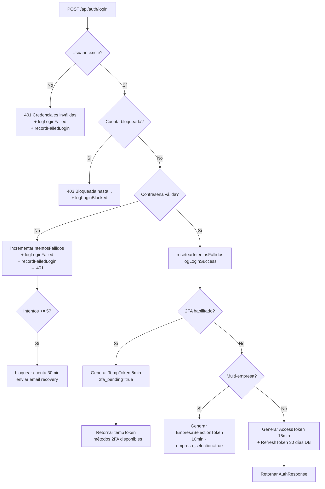
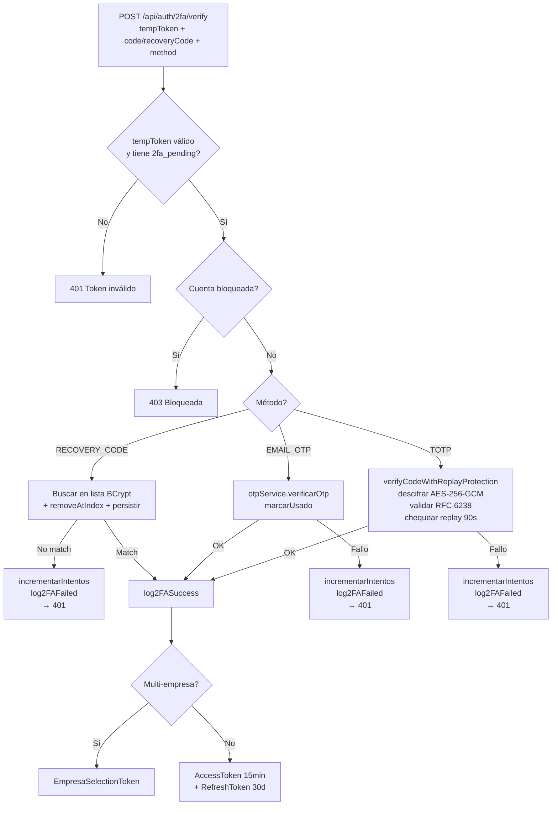
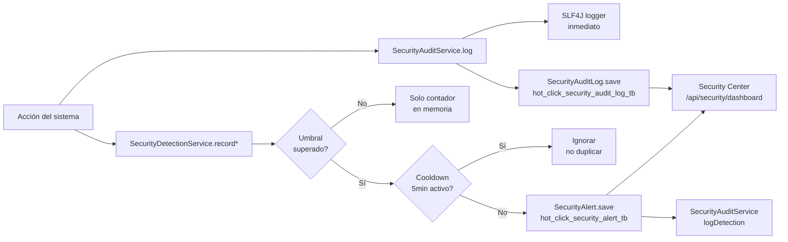

# Security Architecture — Vista Completa

## Arquitectura de capas

```
┌─────────────────────────────────────────────────────────────────┐
│                         INTERNET                                 │
└─────────────────────┬───────────────────────────────────────────┘
                      │ HTTPS (Render CDN)
┌─────────────────────▼───────────────────────────────────────────┐
│                    HTTP LAYER                                    │
│  HSTS · CSP · X-Frame-Options · Referrer-Policy                 │
│  Permissions-Policy · Cross-Origin-Opener-Policy                 │
│  X-Content-Type-Options · X-Request-Id                          │
└─────────────────────┬───────────────────────────────────────────┘
                      │
┌─────────────────────▼───────────────────────────────────────────┐
│                  SPRING FILTER CHAIN                             │
│                                                                  │
│  1. MdcRequestIdFilter      (HIGHEST_PRECEDENCE)                │
│     └─ Genera UUID de traza por request → X-Request-Id header  │
│                                                                  │
│  2. ForwardedHeaderFilter   (framework)                          │
│     └─ Resuelve IP real desde X-Forwarded-For                  │
│                                                                  │
│  3. RateLimitingFilter                                          │
│     └─ Sliding window por IP · 11 endpoints · Emite eventos    │
│                                                                  │
│  4. JwtRequestFilter                                            │
│     └─ Valida JWT · Detecta anomalías de token · Emite eventos │
│                                                                  │
│  5. UsernamePasswordAuthenticationFilter (Spring Security)       │
│                                                                  │
└─────────────────────┬───────────────────────────────────────────┘
                      │
┌─────────────────────▼───────────────────────────────────────────┐
│                  AUTHORIZATION LAYER                             │
│                                                                  │
│  Spring Security HttpSecurity rules                              │
│    permitAll()    → catálogo público, health, webhooks           │
│    authenticated()→ rutas de perfil, pedidos propios             │
│    hasRole(X)     → rutas admin, según tabla de roles            │
│                                                                  │
│  @PreAuthorize ("hasRole('ADMIN_IT')")                          │
│    → Doble validación a nivel de método                          │
│                                                                  │
│  CompanyScope.assertCanAccess(empresaId)                        │
│    → Tenant isolation: recursos deben pertenecer a la empresa   │
│       del JWT o ser ADMIN_IT                                     │
└─────────────────────┬───────────────────────────────────────────┘
                      │
┌─────────────────────▼───────────────────────────────────────────┐
│                  BUSINESS / SERVICE LAYER                        │
│                                                                  │
│  Input validation: @Valid · ConstraintViolation                 │
│  Business rules: stock, estado de cuenta, 2FA required           │
│  Audit calls: SecurityAuditService.log(event, severity, ...)    │
│  Detection: SecurityDetectionService.record*(...)               │
└─────────────────────┬───────────────────────────────────────────┘
                      │
┌─────────────────────▼───────────────────────────────────────────┐
│                   DATA LAYER                                     │
│                                                                  │
│  PostgreSQL on Supabase                                          │
│  ORM: JPA/Hibernate (ddl-auto=none, Flyway managed)            │
│  Connection pool: HikariCP (max 3 conn — Supabase free tier)   │
│  Secrets: env vars only (never in code/properties)              │
│  Migrations: V1–V20 (V20 = security audit + alerts tables)      │
└─────────────────────────────────────────────────────────────────┘
```

---

## Flujos de seguridad principales

### Flujo de login completo



### Flujo de verificación 2FA



### Flujo de evento de seguridad



---

## Componentes de seguridad — Mapa de archivos

```
com.hotclick/
├── config/
│   ├── SecurityConfig.java            ← Spring Security config, CORS, headers
│   ├── GlobalExceptionHandler.java    ← Error handling seguro
│   └── ProductionConfigValidator.java ← Validación de config en startup
│
├── security/
│   ├── JwtUtil.java                   ← Generación/validación JWT (3 tipos)
│   ├── JwtRequestFilter.java          ← Intercepta Bearer tokens, emite eventos
│   ├── RateLimitingFilter.java        ← Rate limit por IP, sliding window
│   ├── CompanyScope.java              ← Tenant isolation, RBAC helpers
│   ├── MdcRequestIdFilter.java        ← UUID de traza por request
│   ├── SecurityEventType.java         ← 32 tipos de evento
│   └── SecurityEventSeverity.java     ← LOW / MEDIUM / HIGH / CRITICAL
│
├── service/
│   ├── SecurityAuditService.java      ← Log centralizado: SLF4J + DB
│   ├── SecurityDetectionService.java  ← Detección en memoria + alertas
│   ├── TwoFactorService.java          ← TOTP RFC 6238, recovery codes
│   ├── TotpSecretEncryptionService.java ← AES-256-GCM para secretos TOTP
│   ├── OtpService.java                ← Email OTP, rate limit, brute force
│   ├── RefreshTokenService.java       ← Tokens UUID, revocación, limpieza
│   ├── PasswordResetService.java      ← Flow de recuperación con OTP
│   ├── CustomUserDetailsService.java  ← UserDetails para Spring Security
│   └── UsuarioService.java            ← incrementarIntentos, bloquear cuenta
│
├── model/
│   ├── SecurityAuditLog.java          ← Entidad log de eventos
│   └── SecurityAlert.java             ← Entidad de alertas de ataque
│
├── repository/
│   ├── SecurityAuditLogRepository.java ← Queries para Security Center
│   └── SecurityAlertRepository.java    ← Queries de alertas
│
└── controller/
    ├── AuthController.java             ← Login, 2FA, refresh, logout
    └── SecurityController.java         ← Security Center API (ADMIN_IT only)

frontend/
└── src/
    ├── pages/admin/AdminSecurityCenter.jsx  ← Security Center UI
    └── services/securityService.js          ← Calls a /api/security/**
```

---

## Naming strategy y base de datos

**Tablas de seguridad (V20):**
```sql
hot_click_security_audit_log_tb  -- Log de eventos (índices en timestamp, event_type, severity, ip)
hot_click_security_alert_tb      -- Alertas de ataque (índices en resolved, severity)
```

**Naming convention:** `PhysicalNamingStrategyStandardImpl` — nombres de columna coinciden exactamente con los campos Java (snake_case → snake_case).

**Restricción crítica:** `ddl-auto=none`. Todo cambio de esquema requiere migración Flyway (`V{N}__descripcion.sql`). Nunca modificar entidades JPA sin su migración correspondiente.
